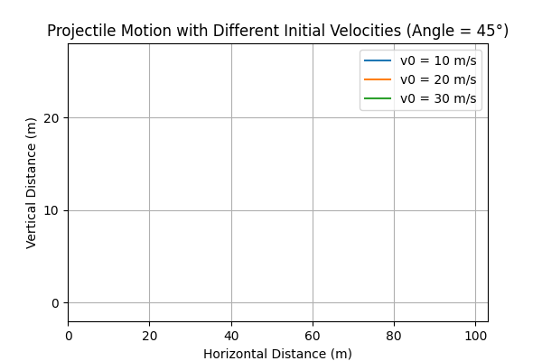
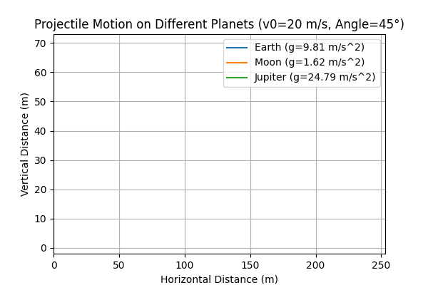
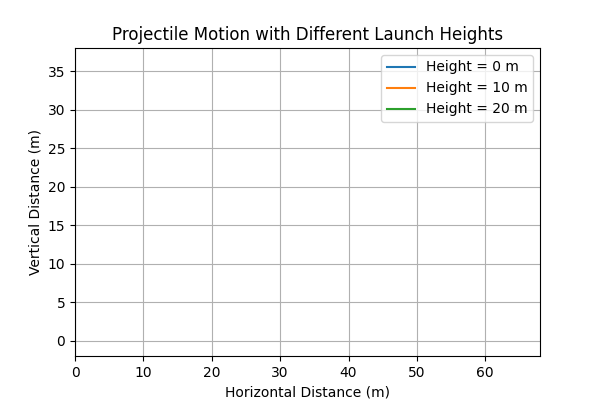
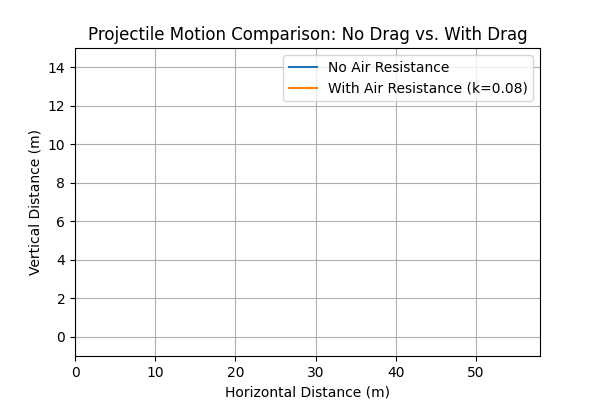

# Problem 1:

# Investigating the Range as a Function of the Angle of Projection

## 1. Introduction

Projectile motion is a cornerstone of classical mechanics, illustrating how an object behaves under uniform gravitational acceleration after being launched with an initial velocity. Although the basic equations of projectile motion are straightforward, the problem offers a rich landscape of analysis. In this report, we investigate how the horizontal range depends on the angle of projection, exploring the theoretical foundation, computational implementation, and real-world applications. We also discuss how variations in initial conditions—such as velocity, gravity, and launch height—expand the family of solutions, giving rise to multiple trajectories that can model diverse physical phenomena.

---

## 2. Theoretical Foundation

### 2.1 Governing Equations

The motion of a projectile in two-dimensional space \((x, y)\) can be derived from Newton’s laws under constant gravitational acceleration \(g\). Neglecting air resistance, the differential equations of motion are:

$$
\frac{d^2 x}{dt^2} = 0, 
\quad
\frac{d^2 y}{dt^2} = -g.
$$

These simplify to:

1. **Horizontal Motion** (no acceleration):
   $$
   \frac{d^2 x}{dt^2} = 0 
   \quad \Longrightarrow \quad
   \frac{dx}{dt} = v_0 \cos(\theta), 
   \quad
   x(t) = v_0 \cos(\theta)\, t.
   $$

2. **Vertical Motion** (constant acceleration \(-g\)):
   $$
   \frac{d^2 y}{dt^2} = -g 
   \quad \Longrightarrow \quad
   \frac{dy}{dt} = v_0 \sin(\theta) - g t, 
   \quad
   y(t) = v_0 \sin(\theta)\, t - \tfrac{1}{2} g t^2.
   $$

Here, 
- \(v_0\) is the initial speed, 
- \(\theta\) is the angle of projection (relative to the horizontal), 
- \(x(t)\) and \(y(t)\) are the horizontal and vertical positions as functions of time.

---

### 2.2 Time of Flight and Range

For a projectile launched from ground level and returning to the same vertical level \((y = 0)\), the time of flight \(T\) is obtained by solving \(y(T) = 0\):

$$
y(T) = v_0 \sin(\theta)\, T - \tfrac{1}{2} g\, T^2 = 0.
$$

This yields two solutions: \(T = 0\) (initial launch) and

$$
T = \frac{2\,v_0 \sin(\theta)}{g}.
$$

Substituting \(T\) into the expression for \(x(t)\) gives the **range** \(R\):

$$
R = x(T) 
  = v_0 \cos(\theta)\,\frac{2\,v_0 \sin(\theta)}{g}
  = \frac{v_0^2 \sin(2\theta)}{g}.
$$

---

### 2.3 Family of Solutions

Varying parameters like \(\theta\), \(v_0\), or \(g\) leads to a family of possible trajectories:

- **Angle \(\theta\)**: Influences the shape of the trajectory. The maximum range is achieved when \(\sin(2\theta) = 1 \implies \theta = 45^\circ\).
- **Initial Velocity \(v_0\)**: The range depends quadratically on \(v_0\). Doubling \(v_0\) quadruples the theoretical range.
- **Gravitational Acceleration \(g\)**: Lower \(g\) (e.g., on the Moon) increases the range; higher \(g\) (e.g., on Jupiter) reduces it.
- **Initial Height \(h\)**: If launched from a nonzero height, the time in the air changes, altering the total range and trajectory shape.

---

## 3. Analysis of the Range

1. **Range vs. Angle**

   $$
   R(\theta) = \frac{v_0^2}{g} \,\sin(2\theta).
   $$

   - **Maximum Range**: \(\theta = 45^\circ\).
   - **Symmetry**: \(\sin(2\theta)\) has the same value for angles \(\theta\) and \((90^\circ - \theta)\).  
     For example, \(30^\circ\) and \(60^\circ\) produce the same range (neglecting air resistance).

2. **Influence of Velocity**  
   - Higher launch velocity shifts the entire range curve upward (since \(v_0^2\) appears in the numerator).

3. **Impact of Gravity**  
   - A smaller \(g\) value extends the flight time and range; a larger \(g\) reduces both.

---

## 4. Practical Applications

Projectile motion underpins many real-world scenarios:

## Sports
- **Football (Soccer):** Kicking the ball with an optimal angle to maximize distance.
- **Basketball:** Adjusting angle and velocity to achieve precise arcs into the hoop.

## Engineering
- **Cannons and Ballistics:** Calculating the range for shells or projectiles under Earth’s gravity.
- **Launch Systems:** Designing rocket trajectories for short suborbital flights.

## Astrophysics
- **Satellite Launches:** Transfer orbits rely on projectile-like arcs under planetary gravity.
- **Interplanetary Missions:** Calculating gravitational assists and slingshots around celestial bodies.

## Environmental Studies
- **Pollutant Dispersion:** Modeling how particles travel in the atmosphere or water.
- **Wildfire Smoke Trajectories:** Predicting how far smoke travels and in which direction.

---

## 5. Implementation

Below you can see the various simulations and just below the simulations there is a comprehensive Python script:

**1. Three different initial velocities** on the same plot (angle fixed).  





**2. Same initial conditions on three different gravitational fields** (e.g., Earth, Moon, Jupiter). 





  **3. Different initial heights** with the same velocity and angle.  





**4. With and without air resistance** for a chosen angle and velocity.





```python
import matplotlib
matplotlib.use('Agg')  

import numpy as np
import matplotlib.pyplot as plt
from matplotlib.animation import FuncAnimation, PillowWriter
import matplotlib.ticker as mticker

############################################
# 1) Projectile with no drag
############################################
def projectile_no_drag(v0, angle_deg, g=9.81, h=0.0, dt=0.02):
    angle_rad = np.radians(angle_deg)
    vx = v0 * np.cos(angle_rad)
    vy = v0 * np.sin(angle_rad)
    
    x_vals, y_vals = [0.0], [h]
    t = 0.0
    while True:
        t += dt
        x_new = vx * t
        y_new = h + vy * t - 0.5*g*(t**2)
        
        x_vals.append(x_new)
        y_vals.append(y_new)
        
        if y_new <= 0:
            break
    return np.array(x_vals), np.array(y_vals)

############################################
# 2) Projectile with linear drag
############################################
def projectile_with_drag(v0, angle_deg, g=9.81, h=0.0, k=0.1, dt=0.02):
    angle_rad = np.radians(angle_deg)
    vx = v0 * np.cos(angle_rad)
    vy = v0 * np.sin(angle_rad)
    
    x_vals, y_vals = [0.0], [h]
    while True:
        ax = -k * vx
        ay = -g - k * vy
        
        vx += ax * dt
        vy_new = vy + ay * dt
        
        x_new = x_vals[-1] + vx * dt
        y_new = y_vals[-1] + vy * dt
        
        x_vals.append(x_new)
        y_vals.append(y_new)
        vy = vy_new
        
        if y_new <= 0:
            break
    return np.array(x_vals), np.array(y_vals)

############################################
# Create animation and save as .gif
############################################
def create_animation(x_arrays, y_arrays, labels, title, gif_name, 
                     xlim=None, ylim=None, xtick=None, ytick=None):
    """
    Creates a FuncAnimation that draws each trajectory step by step,
    then saves it as a .gif file using PillowWriter.
    xlim, ylim: (xmin, xmax), (ymin, ymax)
    xtick, ytick: major tick intervals for x and y
    """
    fig, ax = plt.subplots(figsize=(6,4))
    lines = []
    
    for lab in labels:
        (line,) = ax.plot([], [], label=lab)
        lines.append(line)
    
    ax.set_title(title)
    ax.set_xlabel("Horizontal Distance (m)")
    ax.set_ylabel("Vertical Distance (m)")
    ax.grid(True)
    ax.legend()
    
    
    if xlim: ax.set_xlim(xlim)
    if ylim: ax.set_ylim(ylim)
    
    
    if xtick:
        ax.xaxis.set_major_locator(mticker.MultipleLocator(xtick))
    if ytick:
        ax.yaxis.set_major_locator(mticker.MultipleLocator(ytick))
    
    max_len = max(len(x) for x in x_arrays)
    
    def init():
        for line in lines:
            line.set_data([], [])
        return lines
    
    def update(frame):
        for i in range(len(x_arrays)):
            xs = x_arrays[i][:frame]
            ys = y_arrays[i][:frame]
            lines[i].set_data(xs, ys)
        return lines
    
    anim = FuncAnimation(fig, update, frames=range(max_len), init_func=init, blit=False)
    anim.save(gif_name, writer=PillowWriter(fps=15))
    plt.close(fig)

############################################
# SCENARIO 1: Three different initial velocities
############################################
def scenario1():
    velocities = [10, 20, 30]
    angle = 45
    x_arrays, y_arrays = [], []
    labels = []
    
    for v0 in velocities:
        x, y = projectile_no_drag(v0, angle, 9.81, 0.0, dt=0.02)
        x_arrays.append(x)
        y_arrays.append(y)
        labels.append(f"v0 = {v0} m/s")
    
    # horizontal: 0..103, step 20
    # vertical:   -2..28, step 10
   
    create_animation(
        x_arrays, y_arrays, labels,
        title="Projectile Motion with Different Initial Velocities (Angle = 45°)",
        gif_name="scenario1.gif",
        xlim=(0,103), ylim=(-2,28),
        xtick=20, ytick=10
    )

############################################
# SCENARIO 2: Different gravitational fields
############################################
def scenario2():
    g_planets = {"Earth": 9.81, "Moon": 1.62, "Jupiter": 24.79}
    v0, angle = 20, 45
    x_arrays, y_arrays, labels = [], [], []
    
    for planet, g_val in g_planets.items():
        x, y = projectile_no_drag(v0, angle, g_val, 0.0, dt=0.02)
        x_arrays.append(x)
        y_arrays.append(y)
        labels.append(f"{planet} (g={g_val:.2f} m/s^2)")
    
    # horizontal: 0..253, step 50
    # vertical:   -2..73, step 10
    create_animation(
        x_arrays, y_arrays, labels,
        title="Projectile Motion on Different Planets (v0=20 m/s, Angle=45°)",
        gif_name="scenario2.gif",
        xlim=(0,253), ylim=(-2,73),
        xtick=50, ytick=10
    )

############################################
# SCENARIO 3: Different initial heights
############################################
def scenario3():
    heights = [0, 10, 20]
    v0, angle = 20, 45
    x_arrays, y_arrays, labels = [], [], []
    
    for h in heights:
        x, y = projectile_no_drag(v0, angle, 9.81, h, dt=0.02)
        x_arrays.append(x)
        y_arrays.append(y)
        labels.append(f"Height = {h} m")
    
    # horizontal: 0..68, step 10
    # vertical:   -2..38, step 5
    create_animation(
        x_arrays, y_arrays, labels,
        title="Projectile Motion with Different Launch Heights",
        gif_name="scenario3.gif",
        xlim=(0,68), ylim=(-2,38),
        xtick=10, ytick=5
    )

############################################
# SCENARIO 4: With and without air resistance
############################################
def scenario4():
    x_no_drag, y_no_drag = projectile_no_drag(20, 45, 9.81, 0.0, dt=0.02)
    x_drag, y_drag = projectile_with_drag(20, 45, 9.81, 0.0, k=0.08, dt=0.02)
    
    x_arrays = [x_no_drag, x_drag]
    y_arrays = [y_no_drag, y_drag]
    labels = ["No Air Resistance", "With Air Resistance (k=0.08)"]
    
    # horizontal: 0..58, step 10
    # vertical:   -1..15, step 2
    create_animation(
        x_arrays, y_arrays, labels,
        title="Projectile Motion Comparison: No Drag vs. With Drag",
        gif_name="scenario4.gif",
        xlim=(0,58), ylim=(-1,15),
        xtick=10, ytick=2
    )

if __name__ == "__main__":
    scenario1()
    scenario2()
    scenario3()
    scenario4()
    print("All GIFs created (scenario1.gif, scenario2.gif, scenario3.gif, scenario4.gif).")
```