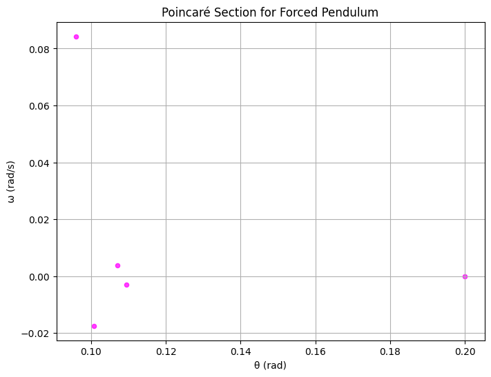

# Problem 2:

# Investigating the Dynamics of a Forced Damped Pendulum

## 1. Theoretical Foundation

We start from the forced damped pendulum equation:

$$
\frac{d^2\theta}{dt^2} + b\frac{d\theta}{dt} + \frac{g}{L}\sin\theta = A\cos(\omega_d t)
$$

### 1.1 Small-Angle Approximation

For small angles, we use the approximation

$$
\sin\theta \approx \theta,
$$

which linearizes the equation to

$$
\frac{d^2\theta}{dt^2} + b\frac{d\theta}{dt} + \frac{g}{L}\theta = A\cos(\omega_d t).
$$

This differential equation has both homogeneous and particular solutions:

- **Homogeneous Solution:**  
  The characteristic equation is  
  $$
  r^2 + b\,r + \frac{g}{L} = 0.
  $$
  Depending on the value of \(b\), the solutions can be real or complex, leading to underdamped or critically damped responses.

### Particular Solution

For the forcing term $A\cos(\omega_d t)$, we try a solution of the form

$$
\theta_p(t) = C\cos\bigl(\omega_d t - \varphi\bigr).
$$

This solution shows maximum amplitude near resonance, where

$$
\omega_d \approx \omega_0 = \sqrt{\frac{g}{L}}.
$$


### 1.2 Energy Considerations and Resonance

The total energy of the pendulum is given by the sum of the kinetic and potential energies:

$$
E(t)= \frac{1}{2}m (L\dot{\theta})^2 + mgL(1-\cos\theta).
$$

- In the resonance condition (especially in the undamped or weakly damped case), energy is pumped into the system from the driving force, increasing the oscillation amplitude.
- In the damped scenario, energy dissipates over time, causing the amplitude to decay.
- In the forced pendulum, the external force introduces complex behaviors including periodic, quasiperiodic, or chaotic dynamics.

## 2. Analysis of Dynamics

We analyze three cases:

- **Pure Pendulum:**  
  \(b=0\) and \(A=0\). The system exhibits undriven, periodic oscillations.
  
- **Damped Pendulum:**  
  \(b \neq 0\) and \(A=0\). Due to energy loss from damping, the amplitude decays over time and the phase space trajectory spirals into the origin.
  
- **Forced (Driven) Pendulum:**  
  \(b=0\) and \(A \neq 0\). The external forcing leads to complex behaviors that can range from periodic motion to chaotic dynamics.

In addition, phase diagrams (plotting \(\theta\) versus \(\dot{\theta}\)) illustrate the system's evolution in state space, and the Poincaré section (sampling the state every driving period) for the forced pendulum reveals transitions to chaotic behavior.

## 3. Practical Applications

The forced damped pendulum model applies in various real-world scenarios, including:

- **Energy Harvesting:**  
  Optimizing energy transfer from vibrations.
- **Suspension Bridges:**  
  Managing vibrations from periodic loads.
- **Oscillating Circuits (Driven RLC Circuits):**  
  Analogous dynamics where resonance and damping are critical.
- **Biomechanics:**  
  Modeling periodic motions such as human gait.

## 4. Implementation

```python
import numpy as np
import matplotlib.pyplot as plt
from scipy.integrate import solve_ivp

# --- Constants ---
g = 9.81       # acceleration due to gravity (m/s^2)
L = 1.0        # length of the pendulum (m)

# --- Pendulum ODE's ---
# y = [theta, omega]
def pendulum_ode(t, y, b, A, omega_drive):
    theta, omega = y
    dtheta_dt = omega
    domega_dt = -b * omega - (g / L) * np.sin(theta) + A * np.cos(omega_drive * t)
    return [dtheta_dt, domega_dt]

# --- Simulation Settings ---
t_span = (0, 40)                                  # simulation time interval (s)
t_eval = np.linspace(t_span[0], t_span[1], 4000)   # time evaluation points
y0 = [0.2, 0.0]                                   # initial conditions: theta=0.2 rad, omega=0

# --- Scenarios ---
# 1. Pure Pendulum: b=0, A=0
sol_pure = solve_ivp(pendulum_ode, t_span, y0, t_eval=t_eval, args=(0.0, 0.0, 0.0))

# 2. Damped Pendulum: b non-zero (e.g., b=0.5), A=0
sol_damped = solve_ivp(pendulum_ode, t_span, y0, t_eval=t_eval, args=(0.5, 0.0, 0.0))

# 3. Forced (Driven) Pendulum: b=0, A non-zero (e.g., A=1.0) and omega_drive=2/3
omega_drive = 2/3
sol_forced = solve_ivp(pendulum_ode, t_span, y0, t_eval=t_eval, args=(0.0, 1.0, omega_drive))

# --- Plots: Time Series ---
plt.figure(figsize=(12,6))
plt.plot(t_eval, sol_pure.y[0], label="Pure Pendulum", linewidth=2)
plt.plot(t_eval, sol_damped.y[0], label="Damped Pendulum (b=0.5)", linestyle="--", linewidth=2)
plt.plot(t_eval, sol_forced.y[0], label="Forced Pendulum (A=1.0, ω_d=2/3)", linestyle=":", linewidth=2)
plt.xlabel("Time (s)")
plt.ylabel("θ (rad)")
plt.title("Time Series Comparison of Pendulum Scenarios")
plt.legend()
plt.grid()
plt.show()

# --- Plots: Phase Space Diagrams ---
plt.figure(figsize=(12,6))
plt.plot(sol_pure.y[0], sol_pure.y[1], label="Pure Pendulum", linewidth=2)
plt.plot(sol_damped.y[0], sol_damped.y[1], label="Damped Pendulum (b=0.5)", linestyle="--", linewidth=2)
plt.plot(sol_forced.y[0], sol_forced.y[1], label="Forced Pendulum (A=1.0, ω_d=2/3)", linestyle=":", linewidth=2)
plt.xlabel("θ (rad)")
plt.ylabel("ω (rad/s)")
plt.title("Phase Space Diagrams of Pendulum Scenarios")
plt.legend()
plt.grid()
plt.show()

# --- Poincaré Section for Forced Pendulum ---
T_drive = 2 * np.pi / omega_drive  # Driving period
indices = [i for i, t in enumerate(t_eval) if np.isclose(t % T_drive, 0, atol=0.01)]
theta_poincare = sol_forced.y[0][indices]
omega_poincare = sol_forced.y[1][indices]

plt.figure(figsize=(8,6))
plt.scatter(theta_poincare, omega_poincare, color="magenta", s=20, alpha=0.75)
plt.xlabel("θ (rad)")
plt.ylabel("ω (rad/s)")
plt.title("Poincaré Section for Forced Pendulum")
plt.grid()
plt.show()

````

## 5. Discussion and Extensions

**Resonance and Energy Transfer:**  
Under the small-angle approximation, the system is linear, and resonance occurs when the driving frequency aligns with the natural frequency, i.e., 
$$\omega_d \approx \frac{g}{L}.$$  
In this state, the driving force continuously feeds energy into the system, raising the oscillation amplitude.

**Effect of Damping:**  
In the damped scenario (e.g., $b=0.5$), energy is dissipated, causing the oscillations to decay over time. The phase space diagram shows a spiral trajectory converging toward the origin.

**Forced Scenario and Chaos:**  
In the forced pendulum case (e.g., $A=1.0$ and $b=0$), the external force may lead to complex behavior, ranging from periodic to chaotic dynamics. The time series, phase diagram, and especially the Poincaré section reveal the transition from regular to chaotic motion.

**Limitations and Extensions:**  
While the model uses the full nonlinear term $\sin\theta$, for small angles the approximation $\sin\theta \approx \theta$ could simplify the analysis. Extensions to the model may include nonlinear damping (e.g., air resistance) or non-periodic driving forces, and further analysis may be conducted via bifurcation diagrams and detailed Poincaré sections.

## 6. Conclusion

This work investigates the dynamics of the forced damped pendulum through both analytical approximations and numerical simulations. By comparing the time series, phase space diagrams, and Poincaré sections across three scenarios—pure, damped, and forced pendulums—we illustrate the system's transition from regular harmonic motion to complex, potentially chaotic behavior. The model provides insights applicable to energy harvesting, vibration control in structures, driven oscillatory circuits, and many other real-world systems. Parameter variations, such as changes in the damping coefficient $b$, driving amplitude $A$, and driving frequency $\omega_d$, offer a rich context for further exploration of resonance, bifurcation, and chaotic transitions.



