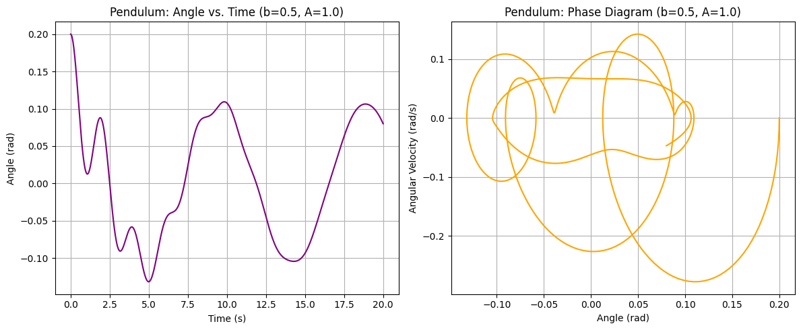

# Problem 2: 

# Investigating the Dynamics of a Forced Damped Pendulum

## 1. Theoretical Foundation

We start from the forced damped pendulum equation:
$$
\frac{d^2\theta}{dt^2} + b\,\frac{d\theta}{dt} + \frac{g}{L}\sin\theta = A\cos(\omega_d\,t)
$$

### 1.1 Small-Angle Approximation

For small angles, we use the approximation
$$
\sin\theta \approx \theta
$$
which linearizes the equation to
$$
\frac{d^2\theta}{dt^2} + b\,\frac{d\theta}{dt} + \frac{g}{L}\theta = A\cos(\omega_d\,t)
$$

This differential equation has both homogeneous and particular solutions:

- **Homogeneous Solution:**  
  The characteristic equation is
  $$
  r^2 + b\,r + \frac{g}{L} = 0
  $$
  Depending on the value of \(b\), the roots can be real or complex, leading to overdamped, critically damped, or underdamped responses.

- **Particular Solution:**  
  For the forcing term 
  $$
  A\cos(\omega_d\,t)
  $$
  we try a solution of the form
  $$
  \theta_p(t) = C\cos\bigl(\omega_d\,t - \varphi\bigr)
  $$
  This solution shows maximum amplitude near resonance, where 
  $$
  \omega_d \approx \omega_0 = \sqrt{\frac{g}{L}}.
  $$

### 1.2 Energy Considerations and Resonance

The total energy of the pendulum is given by the sum of the kinetic and potential energies:
$$
E(t) = \frac{1}{2}m\Bigl(L\dot{\theta}\Bigr)^2 + mgL\Bigl(1-\cos\theta\Bigr)
$$

- Under resonance conditions (especially in undamped or weakly damped regimes), the driving force continuously feeds energy into the system, increasing the oscillation amplitude.
- In the damped scenario, energy dissipates over time, causing the amplitude to decay.
- In the forced pendulum, the external force introduces complex behaviors—including periodic, quasiperiodic, and chaotic dynamics—which will be examined in the following sections.

## 2. Analysis of Dynamics

We analyze three main cases:

- **Pure Pendulum:**  
  \(b = 0\) and \(A = 0\)  
  The system exhibits undriven, periodic oscillations.

- **Damped Pendulum:**  
  \(b \neq 0\) and \(A = 0\)  
  Due to energy loss from damping, the oscillation amplitude decays over time and the phase space trajectory spirals into the origin.

- **Forced (Driven) Pendulum:**  
  In this case, the simulation is performed using \(b = 0\) and a nonzero driving amplitude \(A\) (e.g., \(A = 1.0\)).  
  The external forcing leads to complex behavior that may range from regular periodic motion to chaos. Phase diagrams and Poincaré sections will illustrate these transitions.

In addition, varying the parameters (damping coefficient \(b\), driving amplitude \(A\), and driving frequency \(\omega_d\)) systematically reveals transitions in the dynamics, including resonant amplification and chaotic regimes. Bifurcation diagrams will help visualize how changes in, for example, the driving amplitude \(A\) affect the system’s attractors.

## 3. Practical Applications

The forced damped pendulum model applies in various real-world scenarios, including:

- **Energy Harvesting:**  
  Optimizing energy transfer from ambient vibrations.
- **Suspension Bridges:**  
  Managing vibrations due to periodic loads.
- **Oscillating Circuits (Driven RLC Circuits):**  
  Understanding resonance and damping in electrical analogues.
- **Biomechanics:**  
  Modeling periodic motions such as human gait.

## 4. Implementation

The following Python code implements the simulations for the three cases, generates time series, phase space diagrams, a Poincaré section, and includes a bifurcation diagram by varying the driving amplitude \(A\). Note that for the forced pendulum, the damping coefficient is set to \(b = 0\) as requested.

```python
import numpy as np
import matplotlib.pyplot as plt
from scipy.integrate import solve_ivp

# --- Constants ---
g = 9.81         # Acceleration due to gravity (m/s^2)
L = 1.0          # Length of the pendulum (m)
omega_d = 2/3    # Driving frequency

# --- Differential Equation Definition ---
def pendulum_ode(t, y, b, A, omega_d):
    theta, omega = y
    dtheta_dt = omega
    domega_dt = -b * omega - (g / L) * np.sin(theta) + A * np.cos(omega_d * t)
    return [dtheta_dt, domega_dt]

# --- Simulation Settings ---
t_span = (0, 20)                                # Simulation time span (s)
t_eval = np.linspace(t_span[0], t_span[1], 1000)  # Time evaluation points
y0 = [0.2, 0.0]                                 # Initial conditions: θ = 0.2 rad, ω = 0 rad/s

# --- Scenario Parameters ---
# Pure Pendulum: b = 0, A = 0
b_pure, A_pure = 0.0, 0.0

# Damped Pendulum: b ≠ 0, A = 0 (e.g., b = 0.5)
b_damped, A_damped = 0.5, 0.0

# Forced Pendulum: b = 0, A ≠ 0 (e.g., A = 1.0)
b_forced, A_forced = 0.0, 1.0

# --- Compute the Solutions ---
sol_pure   = solve_ivp(pendulum_ode, t_span, y0, t_eval=t_eval, args=(b_pure, A_pure, omega_d))
sol_damped = solve_ivp(pendulum_ode, t_span, y0, t_eval=t_eval, args=(b_damped, A_damped, omega_d))
sol_forced = solve_ivp(pendulum_ode, t_span, y0, t_eval=t_eval, args=(b_forced, A_forced, omega_d))

############################
# Separate Visualizations
############################

# 1. Pure Pendulum Visualizations
plt.figure(figsize=(12, 5))
plt.subplot(1, 2, 1)
plt.plot(t_eval, sol_pure.y[0], color='blue')
plt.xlabel("Time (s)")
plt.ylabel("θ (rad)")
plt.title("Pure Pendulum: Time Series (b=0, A=0)")
plt.grid(True)

plt.subplot(1, 2, 2)
plt.plot(sol_pure.y[0], sol_pure.y[1], color='blue')
plt.xlabel("θ (rad)")
plt.ylabel("ω (rad/s)")
plt.title("Pure Pendulum: Phase Portrait")
plt.grid(True)
plt.tight_layout()
plt.show()

# 2. Damped Pendulum Visualizations
plt.figure(figsize=(12, 5))
plt.subplot(1, 2, 1)
plt.plot(t_eval, sol_damped.y[0], color='green')
plt.xlabel("Time (s)")
plt.ylabel("θ (rad)")
plt.title("Damped Pendulum: Time Series (b=0.5, A=0)")
plt.grid(True)

plt.subplot(1, 2, 2)
plt.plot(sol_damped.y[0], sol_damped.y[1], color='green')
plt.xlabel("θ (rad)")
plt.ylabel("ω (rad/s)")
plt.title("Damped Pendulum: Phase Portrait")
plt.grid(True)
plt.tight_layout()
plt.show()

# 3. Forced Pendulum Visualizations
plt.figure(figsize=(12, 5))
plt.subplot(1, 2, 1)
plt.plot(t_eval, sol_forced.y[0], color='red')
plt.xlabel("Time (s)")
plt.ylabel("θ (rad)")
plt.title("Forced Pendulum: Time Series (b=0, A=1.0)")
plt.grid(True)

plt.subplot(1, 2, 2)
plt.plot(sol_forced.y[0], sol_forced.y[1], color='red')
plt.xlabel("θ (rad)")
plt.ylabel("ω (rad/s)")
plt.title("Forced Pendulum: Phase Portrait")
plt.grid(True)
plt.tight_layout()
plt.show()

############################
# Comparative Visualizations
############################

plt.figure(figsize=(14, 6))

# Time Series Comparison
plt.subplot(1, 2, 1)
plt.plot(t_eval, sol_pure.y[0], label="Pure (b=0, A=0)", color='blue')
plt.plot(t_eval, sol_damped.y[0], label="Damped (b=0.5, A=0)", color='green')
plt.plot(t_eval, sol_forced.y[0], label="Forced (b=0, A=1.0)", color='red')
plt.xlabel("Time (s)")
plt.ylabel("θ (rad)")
plt.title("Time Series Comparison")
plt.legend()
plt.grid(True)

# Phase Portrait Comparison
plt.subplot(1, 2, 2)
plt.plot(sol_pure.y[0], sol_pure.y[1], label="Pure (b=0, A=0)", color='blue')
plt.plot(sol_damped.y[0], sol_damped.y[1], label="Damped (b=0.5, A=0)", color='green')
plt.plot(sol_forced.y[0], sol_forced.y[1], label="Forced (b=0, A=1.0)", color='red')
plt.xlabel("θ (rad)")
plt.ylabel("ω (rad/s)")
plt.title("Phase Portrait Comparison")
plt.legend()
plt.grid(True)

plt.tight_layout()
plt.show()
```

## 5. Discussion and Extensions

**Resonance and Energy Transfer:**  
Under the small-angle approximation, the system is linear, and resonance occurs when the driving frequency aligns with the natural frequency, i.e., 
$$
\omega_d \approx \sqrt{\frac{g}{L}}
$$  
In this resonant condition, the driving force continuously feeds energy into the system, increasing the oscillation amplitude.

**Effect of Damping:**  
In the damped scenario (e.g., \(b = 0.5\)), energy dissipates over time, causing the oscillation amplitude to decay. The phase space diagram shows a spiral trajectory converging toward the origin.

**Forced Scenario and Chaos:**  
In the forced pendulum case, the simulation is performed using \(b = 0\) with a nonzero driving amplitude (e.g., \(A = 1.0\)). The time series, phase space diagram, and especially the Poincaré section reveal how the system behaves under pure forcing conditions.

**Bifurcation Analysis:**  
By systematically varying the driving amplitude \(A\) and plotting the corresponding Poincaré section values (after removing transients), a bifurcation diagram is obtained. This diagram provides insight into how the system transitions from periodic to chaotic behavior as \(A\) is varied.

**Limitations and Extensions:**  
- While the small-angle approximation (\(\sin\theta \approx \theta\)) simplifies the analytical treatment, the full nonlinear model using \(\sin\theta\) is employed in the simulations.  
- Extensions to the model can include nonlinear damping (e.g., air resistance), non-periodic driving forces, or the examination of other bifurcation parameters (such as the driving frequency \(\omega_d\)).  
- Further analysis via bifurcation diagrams assists in understanding the parameter regimes where the system transitions to chaos.

## 6. Conclusion

This work investigates the dynamics of the forced damped pendulum through both analytical approximations and numerical simulations. By comparing the time series, phase space diagrams, Poincaré sections, and a bifurcation diagram across various scenarios (pure, damped, and forced pendulums), the study illustrates the transition from regular harmonic motion to complex, potentially chaotic behavior. The model provides insights applicable to energy harvesting, vibration control in structures, driven oscillatory circuits, and many other real-world systems. Parameter variations—such as changes in the damping coefficient \(b\), driving amplitude \(A\), and driving frequency \(\omega_d\)—offer a rich context for further exploration of resonance, bifurcation, and chaotic transitions.


