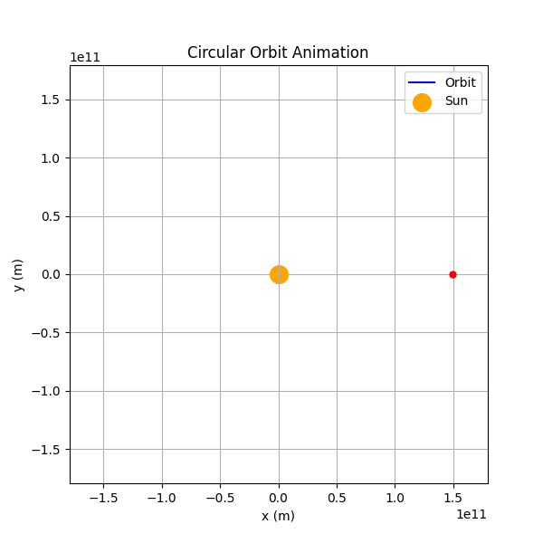
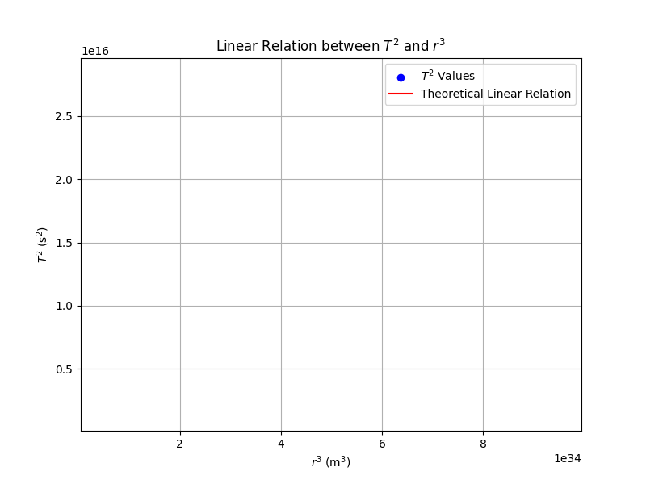

# Problem 1

# Orbital Period and Orbital Radius: Applications of Kepler's Third Law

## 1. Introduction

This document explores the fundamental principles and applications of Kepler's Third Law. According to the law, there is a linear relationship between the square of the orbital period and the cube of the orbital radius for a body in orbit. This law is crucial in analyzing the orbits of planets, moons, and other celestial objects. The solution covers theoretical derivation, real-world examples (such as the Moon's orbit around the Earth and the orbits of planets in the Solar System), and computational verification using Python simulations with animated GIFs.

---

## 2. Theoretical Background

### 2.1 Derivation of Kepler's Third Law for Circular Orbits

For a circular orbit, a planet or satellite moves around a central mass (e.g., the Sun or the Earth) along a path with a constant radius. In such an orbit, the gravitational force supplies the required centripetal force for circular motion.

1. **Gravitational Force**  
   
   $$
   F_{g}=\frac{GMm}{r^2}
   $$  
   
   - \(G\): Universal gravitational constant  
   - \(M\): Mass of the central body  
   - \(m\): Mass of the orbiting object  
   - \(r\): Orbital radius  

2. **Centripetal Force for Circular Motion**  
   
   $$
   F_{c}=m\frac{v^2}{r}
   $$  
   
   - \(v\): Orbital speed of the object  

3. **Equating the Forces**  
   
   In a circular orbit the gravitational force provides the required centripetal force:
   
   $$
   \frac{GMm}{r^2}=m\frac{v^2}{r}
   $$  
   
   Cancelling the mass \(m\):
   
   $$
   v^2=\frac{GM}{r}
   $$

4. **Expressing the Orbital Period**  
   
   The orbital period \(T\) is the time required to complete one full orbit. Given that the orbit's circumference is \(2\pi r\), we have:
   
   $$
   T=\frac{2\pi r}{v}
   $$  
   
   Substituting the expression for \(v\):
   
   $$
   T=2\pi\sqrt{\frac{r^3}{GM}}
   $$

5. **Kepler's Third Law**  
   
   Squaring both sides gives:
   
   $$
   T^2=\frac{4\pi^2}{GM}r^3
   $$  
   
   This result shows that the square of the orbital period is directly proportional to the cube of the orbital radius, with the proportionality constant being \(\frac{4\pi^2}{GM}\).

### 2.2 Conclusion and Interpretation

The derived relationship indicates:  

- **Fundamental Relation:**  
  \(T^2\propto r^3\)  
- Although derived for circular orbits, this proportionality holds for elliptical orbits when the orbital radius is replaced by the semi-major axis.

---

## 3. Astrophysical Applications

### 3.1 Analysis of Planetary and Satellite Orbits

- **Planetary Orbits**  
  In the Solar System, the orbital periods and radii of planets adhere to the relationship defined by Kepler's Third Law. For example, the Earth's orbital radius is approximately \(1.496\times10^{11}\) m and its orbital period is about \(3.16\times10^7\) s, which are consistent with the theoretical formula.
  
- **Moon’s Orbit**  
  The Moon’s orbit around the Earth can be similarly analyzed. With an orbital radius of roughly \(384400\) km and a period of about \(27.3\) days, these values enable calculations of other system properties and central masses using Kepler's relation.

### 3.2 Mass and Distance Calculations

- **Calculating the Central Mass**  
  If the orbital period and radius are known for a satellite or planet, the mass of the central body (e.g., the Sun) can be calculated by rearranging Kepler’s law:
  
  $$
  M=\frac{4\pi^2r^3}{GT^2}
  $$

- **Spacecraft and Artificial Satellites**  
  This law is also applicable in orbit determination for spacecraft and artificial satellites, providing critical insights for mission design and orbital maintenance.

---

## 4. Computational Model and Simulation Using Python

The following Python scripts simulate both circular orbits and the linear relationship between \(T^2\) and \(r^3\). Both animations are generated and saved as animated GIFs.

### 4.1 Circular Orbit Animation

The animated GIF below displays the simulation of Earth's circular orbit around the Sun. In the animation, the orbit is gradually traced while a moving point represents the planet. The Python code used to generate this animation is provided below.




```python
# Import necessary libraries
import numpy as np
import matplotlib.pyplot as plt
from matplotlib.animation import FuncAnimation, PillowWriter

# Universal constants and parameters
G = 6.67430e-11  # Universal gravitational constant (m^3 kg^-1 s^-2)
M = 1.989e30     # Mass of the Sun (kg)
r = 1.496e11     # Average distance of Earth from the Sun (m)

# Earth's orbital speed
v = np.sqrt(G * M / r)

# Orbital period calculation
T = 2 * np.pi * np.sqrt(r**3 / (G * M))
print(f"Orbital Period (T): {T:.2e} s")

# Simulation parameters
num_frames = 200  # Number of frames for the animation
t = np.linspace(0, T, num_frames)
theta = 2 * np.pi * t / T  # Angular position as a function of time

# Orbit coordinates in the x-y plane
x = r * np.cos(theta)
y = r * np.sin(theta)

# Create the figure and axis
fig, ax = plt.subplots(figsize=(6,6))
ax.set_xlim(-1.2 * r, 1.2 * r)
ax.set_ylim(-1.2 * r, 1.2 * r)
ax.set_title("Circular Orbit Animation")
ax.set_xlabel("x (m)")
ax.set_ylabel("y (m)")
ax.grid(True)
ax.set_aspect('equal')

# Initialize plot elements: orbit line and moving point for the planet
orbit_line, = ax.plot([], [], 'b-', label="Orbit")
planet_point, = ax.plot([], [], 'ro', markersize=5)  # moving point for the planet
ax.scatter(0, 0, color='orange', s=200, label="Sun")
ax.legend()

def init():
    orbit_line.set_data([], [])
    planet_point.set_data([], [])
    return orbit_line, planet_point

def update(frame):
    # Update the orbit trace and the current position of the planet
    orbit_line.set_data(x[:frame], y[:frame])
    # Wrap the single x,y values in lists to provide sequences
    planet_point.set_data([x[frame-1]], [y[frame-1]])
    return orbit_line, planet_point

# Create the animation using frames from 1 to num_frames (avoiding frame 0)
anim = FuncAnimation(fig, update, frames=range(1, num_frames+1), init_func=init, blit=True, interval=50)

# Save the animation as an animated GIF
anim.save('circular_orbit.gif', writer=PillowWriter(fps=20))
plt.close()
```

### 4.2 \(T^2\) vs.\(r^3\) Animation

The animated GIF below illustrates how the scatter plot of \(T^2\) versus \(r^3\) is built up incrementally, along with the gradual drawing of the theoretical linear relation. Following the GIF, the Python code used to generate this animation is provided.




```python
# Import necessary libraries
import numpy as np
import matplotlib.pyplot as plt
from matplotlib.animation import FuncAnimation, PillowWriter

# Universal constants and parameters
G = 6.67430e-11  # Universal gravitational constant (m^3 kg^-1 s^-2)
M = 1.989e30     # Mass of the Sun (kg)

# Generate values for different orbital radii (from 0.5 AU to 3 AU)
r_vals = np.linspace(0.5, 3, 50) * 1.496e11  # Converting AU to meters (1 AU = 1.496e11 m)
T_vals = 2 * np.pi * np.sqrt(r_vals**3 / (G * M))

# Calculate T^2 and r^3 values
T_squared = T_vals**2
r_cubed = r_vals**3

# Create the figure and axis
fig2, ax2 = plt.subplots(figsize=(8,6))
ax2.set_xlabel("$r^3$ (m$^3$)")
ax2.set_ylabel("$T^2$ (s$^2$)")
ax2.set_title("Linear Relation between $T^2$ and $r^3$")
ax2.grid(True)
ax2.set_xlim(np.min(r_cubed)*0.9, np.max(r_cubed)*1.1)
ax2.set_ylim(np.min(T_squared)*0.9, np.max(T_squared)*1.1)

# Initialize plot elements: scatter plot and the theoretical line
scatter = ax2.scatter([], [], color='blue', label="$T^2$ Values")
line_plot, = ax2.plot([], [], 'r-', label="Theoretical Linear Relation")
ax2.legend()

num_points = len(r_cubed)

def init2():
    # Initialize with an empty 2D array of shape (0,2) to avoid indexing errors
    scatter.set_offsets(np.empty((0, 2)))
    line_plot.set_data([], [])
    return scatter, line_plot

def update2(frame):
    # Update scatter points incrementally
    current_points = np.column_stack((r_cubed[:frame], T_squared[:frame]))
    scatter.set_offsets(current_points)
    
    # Compute and update the theoretical linear relation
    slope = 4 * np.pi**2 / (G * M)
    x_fit = np.linspace(np.min(r_cubed), np.max(r_cubed), 100)
    y_fit = slope * x_fit
    # Animate the drawing of the line gradually
    fraction = frame / num_points
    idx = int(len(x_fit) * fraction)
    line_plot.set_data(x_fit[:idx], y_fit[:idx])
    return scatter, line_plot

# Create the animation
anim2 = FuncAnimation(fig2, update2, frames=num_points, init_func=init2, blit=True, interval=100)

# Save the animation as an animated GIF
anim2.save('T2_vs_r3.gif', writer=PillowWriter(fps=10))
plt.close()
```

---

## 5. Graphical Representations

The animated GIFs generated from the Python code illustrate the following:

- **Orbit Animation:** Displays the circular orbit of a planet (Earth) around the Sun in motion, with the orbit traced gradually and a moving point representing the planet.
- **\(T^2\) vs.\(r^3\) Animation:** Demonstrates incrementally how the computed \(T^2\) values versus \(r^3\) build up, along with the progressive drawing of the theoretical linear relation  
  $$
  T^2=\frac{4\pi^2}{GM}r^3.
  $$

These animations confirm that Kepler’s Third Law is both mathematically consistent and practically observable.

---

## 6. Extension to Elliptical Orbits

In reality, many planets and satellites follow elliptical orbits rather than perfect circles. Kepler’s Third Law still applies for elliptical orbits when the orbital radius is replaced by the **semi-major axis (\(a\))**:

$$
T^2=\frac{4\pi^2}{GM}a^3
$$

Here:

- \(a\): The semi-major axis of the elliptical orbit

This extension is essential when analyzing slightly eccentric orbits. Although minor corrections might be necessary for highly elliptical cases, the basic proportionality remains valid.

---

## 7. Conclusion

In this solution:

- **Derivation:** The gravitational and centripetal forces were equated to derive the relation  
  $$
  T^2=\frac{4\pi^2}{GM}r^3
  $$  
  for circular orbits.
- **Astrophysical Applications:** The formula is used to analyze planetary and satellite orbits and to calculate the masses of central objects (e.g., the Sun or the Earth).
- **Simulation:** Python simulations with animated GIFs have been used to visualize both the circular orbit and the linear relationship between \(T^2\) and \(r^3\).
- **Extension to Elliptical Orbits:** The solution extends to elliptical orbits using the semi-major axis, maintaining the validity of the relationship.
