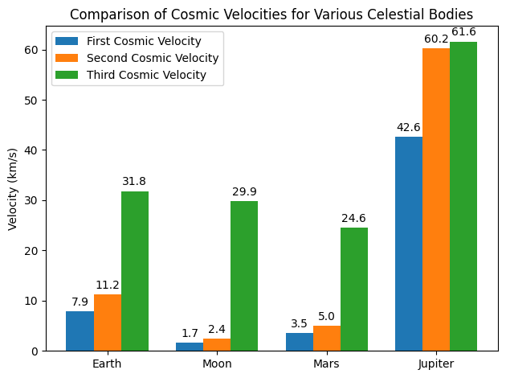

# Problem 2

# Escape Velocities and Cosmic Velocities

## Motivation

Understanding escape velocity is essential for space exploration. The concepts of the **first**, **second**, and **third cosmic velocities** extend this idea. They define the minimum speeds required to:
- Maintain a **stable circular orbit** near the surface (first cosmic velocity),
- **Escape** the gravitational pull of a celestial body (second cosmic velocity), and
- Escape from the host star's gravitational field once the body’s own gravity has been overcome (third cosmic velocity).

These thresholds are crucial not only for launching satellites but also for interplanetary and potential interstellar missions.

---

## 1. Definitions and Derivations

### 1.1 First Cosmic Velocity (Orbital Velocity)

The **first cosmic velocity** is the speed required for an object to maintain a circular orbit just above the celestial body’s surface. Deriving it starts by balancing the gravitational force with the required centripetal force:

$$
\frac{m\, v_1^2}{R} = \frac{G\, M\, m}{R^2},
$$

which simplifies to

$$
v_1 = \sqrt{\frac{GM}{R}}.
$$

---

### 1.2 Second Cosmic Velocity (Escape Velocity)

The **second cosmic velocity** is the minimum speed to escape the gravitational field from the surface. Using the conservation of energy – setting the total energy (kinetic plus potential) equal to zero – we have:

$$
\frac{1}{2} m\, v_2^2 - \frac{G\, M\, m}{R} = 0,
$$

which leads to

$$
v_2 = \sqrt{\frac{2GM}{R}}.
$$

Notice that

$$
v_2 = \sqrt{2}\, v_1.
$$

---

### 1.3 Third Cosmic Velocity (Heliocentric Escape Velocity)

The **third cosmic velocity** addresses the condition for a spacecraft to escape the gravitational influence of both the celestial body and its host star (e.g., the Sun). After escaping the body’s gravity, the spacecraft inherits the body’s heliocentric orbital speed, \(v_{orb}\). To completely escape the star’s gravity, the spacecraft’s resultant heliocentric speed must exceed the solar escape speed.

Thus, assuming the optimal case where the velocities add vectorially (i.e., when the launch direction is collinear with the orbital motion), the third cosmic velocity is given by:

$$
v_3 = \sqrt{v_2^2 + v_{orb}^2}.
$$

Here, \(v_{orb}\) is the orbital speed of the celestial body around the Sun.

---

## 2. Calculation of Cosmic Velocities

We now compute the three cosmic velocities for Earth and compare them with values for the Moon, Mars, and Jupiter.

### 2.1 Parameters

Let the universal gravitational constant be

$$
G = 6.67430 \times 10^{-11}\; \text{m}^3\,\text{kg}^{-1}\,\text{s}^{-2}.
$$

The properties of the bodies are as follows:

**Earth:**
- Mass: \( M_E = 5.972 \times 10^{24}\, \text{kg} \)
- Radius: \( R_E = 6.371 \times 10^{6}\, \text{m} \)
- Orbital velocity: \( v_{orb,E} \approx 29.78\, \text{km/s} = 29780\, \text{m/s} \)

**Moon:**
- Mass: \( M_M = 7.35 \times 10^{22}\, \text{kg} \)
- Radius: \( R_M = 1.7374 \times 10^{6}\, \text{m} \)
- Orbital velocity (around the Sun, nearly identical to Earth’s): \( v_{orb,M} \approx 29780\, \text{m/s} \)

**Mars:**
- Mass: \( M_{Mars} = 6.39 \times 10^{23}\, \text{kg} \)
- Radius: \( R_{Mars} = 3.3895 \times 10^{6}\, \text{m} \)
- Orbital velocity: \( v_{orb,Mars} \approx 24077\, \text{m/s} \)

**Jupiter:**
- Mass: \( M_J = 1.898 \times 10^{27}\, \text{kg} \)
- Radius: \( R_J = 6.9911 \times 10^{7}\, \text{m} \)
- Orbital velocity: \( v_{orb,J} \approx 13070\, \text{m/s} \)

The formulas used are:

$$
v_1 = \sqrt{\frac{GM}{R}},\quad
v_2 = \sqrt{\frac{2GM}{R}},\quad
v_3 = \sqrt{v_2^2 + v_{orb}^2}.
$$

For **Earth**, this yields approximately:
- \( v_1 \approx 7.91\, \text{km/s} \)
- \( v_2 \approx 11.18\, \text{km/s} \)
- \( v_3 \approx \sqrt{(11.18)^2 + (29.78)^2} \approx 31.60\, \text{km/s} \)

---

## 3. Python Implementation and Simulation

Below is a Python script (or notebook cell) that calculates these velocities for each celestial body and produces a bar chart for visual comparison.

```python
import math
import matplotlib.pyplot as plt
import numpy as np

# Constants
G = 6.67430e-11  # gravitational constant in m^3 kg^-1 s^-2

# Data for celestial bodies: mass in kg, radius in m, orbital velocity (m/s)
bodies = {
    'Earth':   {'mass': 5.972e24, 'radius': 6.371e6,  'v_orb': 29780},
    'Moon':    {'mass': 7.35e22,  'radius': 1.7374e6, 'v_orb': 29780},
    'Mars':    {'mass': 6.39e23,  'radius': 3.3895e6, 'v_orb': 24077},
    'Jupiter': {'mass': 1.898e27, 'radius': 6.9911e7, 'v_orb': 13070},
}

# Function to compute cosmic velocities: v1, v2, v3
def compute_velocities(mass, radius, v_orb):
    v1 = math.sqrt(G * mass / radius)      # First cosmic velocity (orbital)
    v2 = math.sqrt(2 * G * mass / radius)    # Second cosmic velocity (escape)
    v3 = math.sqrt(v2**2 + v_orb**2)           # Third cosmic velocity (heliocentric escape)
    return v1, v2, v3

# Calculate the velocities and store the results
results = {}
for body, params in bodies.items():
    v1, v2, v3 = compute_velocities(params['mass'], params['radius'], params['v_orb'])
    results[body] = {'v1': v1, 'v2': v2, 'v3': v3}

# Print results in km/s
print("Cosmic Velocities (in km/s):")
for body, v in results.items():
    print(f"{body}:")
    print(f"  First Cosmic Velocity (v1): {v['v1']/1000:.2f} km/s")
    print(f"  Second Cosmic Velocity (v2): {v['v2']/1000:.2f} km/s")
    print(f"  Third Cosmic Velocity (v3): {v['v3']/1000:.2f} km/s")
    print("")

# Visualization: Bar chart to compare velocities for each celestial body
labels = list(bodies.keys())
v1_values = [results[body]['v1']/1000 for body in labels]
v2_values = [results[body]['v2']/1000 for body in labels]
v3_values = [results[body]['v3']/1000 for body in labels]

x = np.arange(len(labels))  # label locations
width = 0.25  # width of each bar

fig, ax = plt.subplots()
rects1 = ax.bar(x - width, v1_values, width, label='First Cosmic Velocity')
rects2 = ax.bar(x, v2_values, width, label='Second Cosmic Velocity')
rects3 = ax.bar(x + width, v3_values, width, label='Third Cosmic Velocity')

# Add labels, title, and custom x-axis tick labels
ax.set_ylabel('Velocity (km/s)')
ax.set_title('Comparison of Cosmic Velocities for Various Celestial Bodies')
ax.set_xticks(x)
ax.set_xticklabels(labels)
ax.legend()

# Function to annotate bars with their height values
def autolabel(rects):
    for rect in rects:
        height = rect.get_height()
        ax.annotate(f'{height:.1f}',
                    xy=(rect.get_x() + rect.get_width()/2, height),
                    xytext=(0, 3),  # vertical offset in points
                    textcoords="offset points",
                    ha='center', va='bottom')

autolabel(rects1)
autolabel(rects2)
autolabel(rects3)

plt.tight_layout()
plt.show()
```

## 4. Discussion

- **First Cosmic Velocity, \( v_1 = \sqrt{\frac{GM}{R}} \):**  
  This value indicates the speed required to remain in a circular orbit just above the surface. For Earth, it is about 7.91 km/s.

- **Second Cosmic Velocity, \( v_2 = \sqrt{\frac{2GM}{R}} \):**  
  This is the escape speed from the gravitational pull of the celestial body. Earth's value is approximately 11.18 km/s.

- **Third Cosmic Velocity, \( v_3 = \sqrt{v_2^2 + v_{orb}^2} \):**  
  This speed ensures that, after leaving the planet, the spacecraft not only escapes the planet’s gravity but also has enough speed (when combined with the planet's orbital velocity) to overcome the Sun's gravitational pull. For Earth, this is roughly 31.60 km/s.

The differences in the computed velocities across Earth, the Moon, Mars, and Jupiter illustrate how variations in mass, radius, and orbital velocities influence the energy requirements for space missions. For instance, even though Jupiter has a significantly higher escape velocity because of its large mass, its relatively lower orbital speed around the Sun means that the third cosmic velocity is only marginally higher than its escape velocity.

---

## 5. Conclusion

This document provided a detailed derivation of the three cosmic velocities and computed their numerical values for Earth, while also offering a comparative analysis with the Moon, Mars, and Jupiter. These analyses are critical for planning and executing space missions—from satellite launches to interplanetary travel—by addressing the challenges of overcoming both a celestial body's local gravitational field and the broader gravitational pull of the host star.





