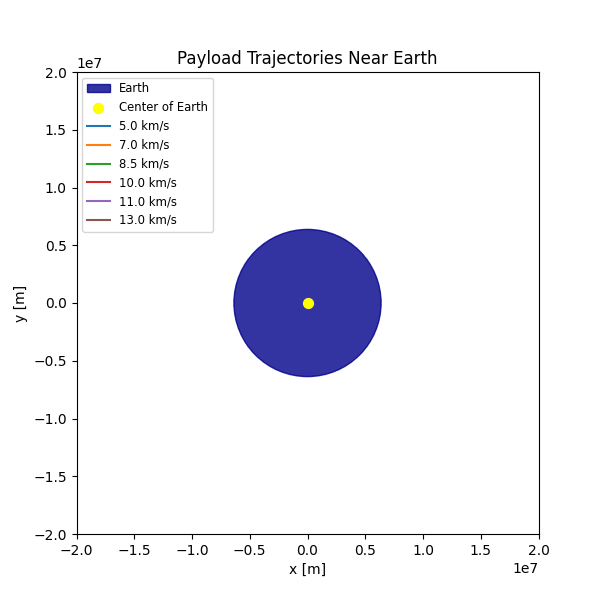
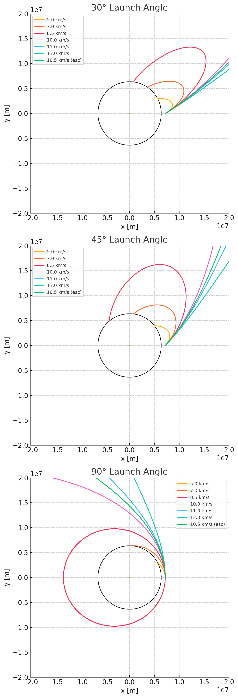

#### Problem 3

## Trajectories of a Freely Released Payload Near Earth

### 1. Introduction
When an object is released from a moving rocket near Earth, its subsequent path depends critically on its initial position, velocity vector, and gravitational forces. Possible trajectories include:

- **Elliptical**: Closed orbits when the specific orbital energy is negative.
- **Parabolic**: Marginal escape at zero specific energy.
- **Hyperbolic**: Open, escape trajectories when specific energy is positive.

This document analyzes these cases, derives the governing equations, and provides a Python-based simulation tool for visualizing payload trajectories.

---

### 2. Theoretical Background

#### 2.1 Newton's Law of Gravitation

$$
F = \frac{G M_e m}{r^2},
$$

where:

- \(G\) = 6.67430e-11 m³·kg⁻¹·s⁻² (gravitational constant)
- \(M_e\) ≈ 5.972e24 kg (Earth mass)
- \(r\) = distance from Earth's center

The resulting acceleration on the payload is:

$$
\mathbf{a}(\mathbf{r}) = -\frac{G M_e}{r^3} \mathbf{r}.
$$

#### 2.2 Specific Orbital Energy

$$
\epsilon = \frac{v^2}{2} - \frac{G M_e}{r}.
$$

- \(\epsilon < 0\): elliptical orbit
- \(\epsilon = 0\): parabolic (escape)
- \(\epsilon > 0\): hyperbolic (escape)

The escape velocity at radius \(r\) is:

$$
v_{esc} = \sqrt{\frac{2 G M_e}{r}}.
$$

---

### 3. Equations of Motion and Numerical Integration
We integrate the second-order ODE:

$$
\ddot{\mathbf{r}} = -\frac{G M_e}{\|\mathbf{r}\|^3} \mathbf{r}
$$

into a system of first-order ODEs:

$$
\begin{cases}
\dot{\mathbf{r}} = \mathbf{v}, \\
\dot{\mathbf{v}} = -\frac{G M_e}{\|\mathbf{r}\|^3} \mathbf{r}.
\end{cases}
$$

We use a fourth-order Runge–Kutta integrator (RK4).

---




---
### 4. Discussion of Results
- **Suborbital**: The payload falls back to Earth before completing an orbit.
- **Elliptical (LEO)**: The payload enters a closed orbit, demonstrating stable insertion possible for satellite deployment.
- **Hyperbolic/Escape**: The payload exceeds escape velocity and departs Earth's gravitational well.

These outcomes map directly onto real mission profiles:
- **Orbital insertion** requires precise velocity vector alignment around circular speed.
- **Reentry** scenarios often begin suborbital or require a retrograde burn to transition from orbit into an atmospheric descent.
- **Escape** trajectories underpin lunar, interplanetary, or deep-space missions.

---

### 5. Extensions and Further Work
- Incorporate atmospheric drag for reentry modeling.
- Extend to three dimensions and include Earth's rotation (Coriolis effects).
- Add perturbations: J2 oblateness, solar radiation pressure, third-body gravity.

---

### 6. Conclusion
This tool and analysis enable exploration of payload trajectories near Earth, from suborbital hops to interplanetary escape, illustrating the critical dependence on initial conditions and gravitational dynamics.


### 7. Python Simulation Scripts
```python
import numpy as np
import matplotlib.pyplot as plt
from matplotlib import animation
from matplotlib.animation import PillowWriter

# === Physical constants ===
mu = 3.986004418e14           # [m^3/s^2]
Re = 6.371e6                  # [m]
alt = 800e3                   # [m]
r0 = np.array([Re + alt, 0])  # initial position

# Six initial speeds [m/s]
v_list = np.array([5, 7, 8.5, 10, 11, 13]) * 1e3

# Time settings
dt = 10.0                     # [s]
t_max = 2e4                   # [s]
num_steps = int(t_max / dt)

def integrate_with_impact(v0):
    traj = np.full((num_steps, 4), np.nan)
    traj[0] = [r0[0], r0[1], 0.0, v0]
    for i in range(1, num_steps):
        x, y, vx, vy = traj[i-1]
        r = np.hypot(x, y)
        if r <= Re:
            break
        # RK4 integration
        def deriv(s):
            rr = np.hypot(s[0], s[1])
            return [s[2], s[3], -mu * s[0] / rr**3, -mu * s[1] / rr**3]
        k1 = deriv([x, y, vx, vy])
        k2 = deriv([x+0.5*dt*k1[0], y+0.5*dt*k1[1], vx+0.5*dt*k1[2], vy+0.5*dt*k1[3]])
        k3 = deriv([x+0.5*dt*k2[0], y+0.5*dt*k2[1], vx+0.5*dt*k2[2], vy+0.5*dt*k2[3]])
        k4 = deriv([x+dt*k3[0],   y+dt*k3[1],   vx+dt*k3[2],   vy+dt*k3[3]])
        traj[i] = traj[i-1] + (dt/6)*(np.array(k1) + 2*np.array(k2)
                                     + 2*np.array(k3) + np.array(k4))
    return traj

# Compute trajectories
trajectories = [integrate_with_impact(v) for v in v_list]

# === Plot setup ===
fig, ax = plt.subplots(figsize=(6,6))
ax.set_aspect('equal')
ax.set_xlim(-2e7, 2e7)
ax.set_ylim(-2e7, 2e7)
ax.set_xlabel('x [m]')
ax.set_ylabel('y [m]')
ax.set_title('Payload Trajectories Near Earth')

from matplotlib.patches import Circle
# Earth patch (dark blue) with legend label
earth = Circle((0, 0), Re, color='darkblue', alpha=0.8, label='Earth')
ax.add_patch(earth)

# Center point (yellow) with legend label
ax.scatter(0, 0, color='yellow', s=50, label='Center of Earth')

# Trajectory lines with distinct tab10 colors
colors = plt.cm.tab10(np.arange(len(v_list)))
lines = []
for i, v in enumerate(v_list):
    ln, = ax.plot([], [], color=colors[i], label=f'{v/1e3:.1f} km/s')
    lines.append(ln)

# Combined legend for speeds, Earth, and center
ax.legend(loc='upper left', fontsize='small')

def init():
    for ln in lines:
        ln.set_data([], [])
    return lines

def update(frame):
    for idx, traj in enumerate(trajectories):
        x = traj[:frame, 0]
        y = traj[:frame, 1]
        lines[idx].set_data(x, y)
    return lines

ani = animation.FuncAnimation(fig, update, frames=num_steps,
                              init_func=init, interval=20, blit=True)

# Save as GIF, 30 seconds total
fps_gif = num_steps / 30.0
ani.save('trajectories.gif', writer=PillowWriter(fps=fps_gif))
print("Saved animation as trajectories.gif (30 seconds)")
```


```python
import numpy as np
import matplotlib.pyplot as plt

# === Physical constants ===
mu = 3.986004418e14           # [m^3/s^2]
Re = 6.371e6                  # [m]
alt = 800e3                   # [m]
r0 = np.array([Re + alt, 0])  # initial position

# Time settings
dt = 10.0                     # [s]
t_max = 2e4                   # [s]
num_steps = int(t_max / dt)

def integrate(v_mag, angle_deg):
    """
    Integrate trajectory given speed magnitude and launch angle.
    Returns an array of shape (n,4): [x, y, vx, vy]
    """
    angle = np.deg2rad(angle_deg)
    v0 = v_mag * np.array([np.cos(angle), np.sin(angle)])
    traj = np.full((num_steps, 4), np.nan)
    traj[0] = [r0[0], r0[1], v0[0], v0[1]]

    def deriv(s):
        rr = np.hypot(s[0], s[1])
        return [s[2], s[3], -mu * s[0] / rr**3, -mu * s[1] / rr**3]

    for i in range(1, num_steps):
        x, y, vx, vy = traj[i-1]
        r = np.hypot(x, y)
        if r <= Re:
            return traj[:i]  # stop at impact
        k1 = deriv([x, y, vx, vy])
        k2 = deriv([x+0.5*dt*k1[0], y+0.5*dt*k1[1], vx+0.5*dt*k1[2], vy+0.5*dt*k1[3]])
        k3 = deriv([x+0.5*dt*k2[0], y+0.5*dt*k2[1], vx+0.5*dt*k2[2], vy+0.5*dt*k2[3]])
        k4 = deriv([x+dt*k3[0],   y+dt*k3[1],   vx+dt*k3[2],   vy+dt*k3[3]])
        traj[i] = traj[i-1] + (dt/6)*(np.array(k1) + 2*np.array(k2) + 2*np.array(k3) + np.array(k4))
    return traj

# Speeds including escape velocity
base_speeds = np.array([5, 7, 8.5, 10, 11, 13]) * 1e3
v_escape = np.sqrt(2 * mu / np.linalg.norm(r0))
speeds = np.append(base_speeds, v_escape)

# Angles to plot
angles = [30, 45, 90]

# Create subplots stacked vertically
fig, axes = plt.subplots(nrows=3, ncols=1, figsize=(6, 18))

for ax, angle in zip(axes, angles):
    # Compute trajectories for this angle
    trajectories = [integrate(v, angle) for v in speeds]
    labels = [f"{v/1e3:.1f} km/s" + (" (esc)" if np.isclose(v, v_escape) else "") for v in speeds]

    # Plot each trajectory
    for traj, label in zip(trajectories, labels):
        ax.plot(traj[:,0], traj[:,1], label=label)

    # Draw Earth outline
    from matplotlib.patches import Circle
    circle = Circle((0, 0), Re, fill=False)
    ax.add_patch(circle)
    ax.scatter(0, 0, s=5)

    ax.set_aspect('equal')
    ax.set_xlim(-2e7, 2e7)
    ax.set_ylim(-2e7, 2e7)
    ax.set_title(f'{angle}° Launch Angle')
    ax.set_xlabel('x [m]')
    ax.set_ylabel('y [m]')
    ax.legend(fontsize='small')

plt.tight_layout()
plt.show()
```
