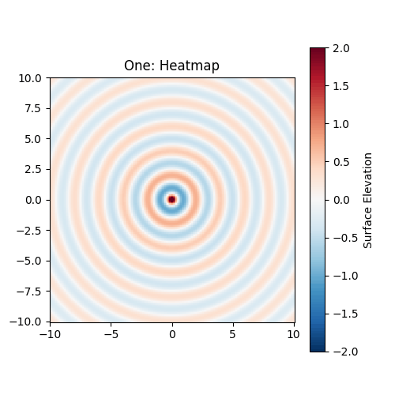
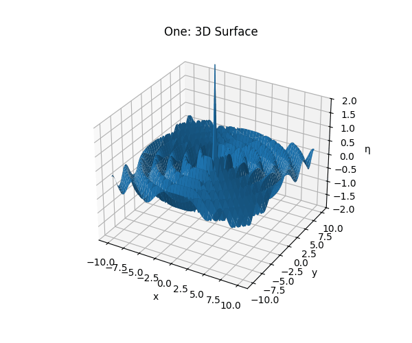
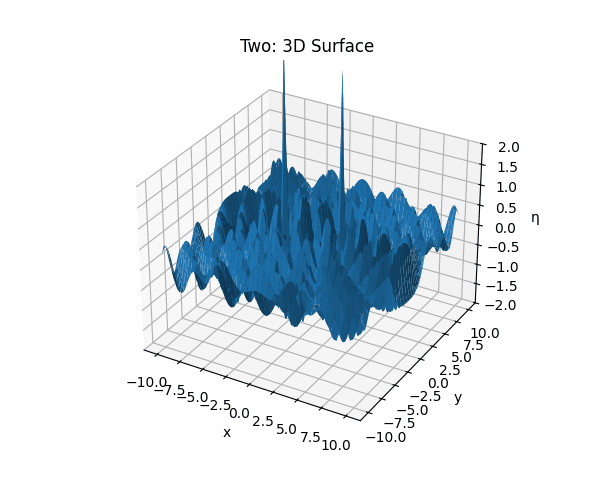
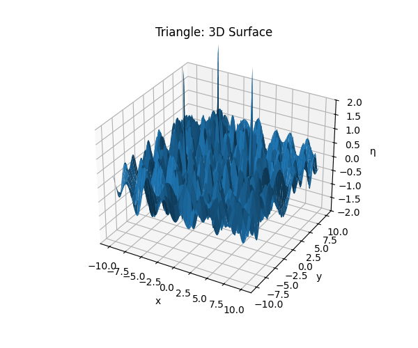
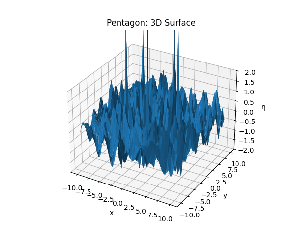

### Problem 1

# Interference Patterns on a Water Surface

## 1. Theoretical Background

### 1.1 Single-Source Circular Wave

A circular wave emanating from a point source at \((x_0, y_0)\) is described by:

$$
\eta(x, y, t) \;=\; \frac{A}{\sqrt{r}} \,\cos\!\bigl(k\,r \;-\;\omega\,t \;+\;\phi\bigr)
$$

where:

- \(\eta(x,y,t)\) is the surface displacement at \((x,y)\) and time \(t\).  
- \(A\) is the wave amplitude.  
- \(k = \frac{2\pi}{\lambda}\) is the wave number (\(\lambda\) = wavelength).  
- \(\omega = 2\pi f\) is the angular frequency (\(f\) = frequency).  
- \(r = \sqrt{(x - x_0)^2 + (y - y_0)^2}\) is the radial distance from the source.  
- \(\phi\) is the initial phase.

### 1.2 Three Cases of Source Configuration

1. **One source** at \((0,0)\).  
2. **Two sources** symmetrically at \(\bigl(\pm d/2,\,0\bigr)\).  
3. **Multiple sources** at vertices of a regular \(N\)-gon of circumradius \(R\):
   - Equilateral triangle (\(N=3\))  
   - Regular pentagon (\(N=5\))  

### 1.3 Superposition Principle

For \(N\) coherent sources,

$$
\eta_{\mathrm{sum}}(x,y,t) \;=\; \sum_{i=1}^{N} \frac{A}{\sqrt{r_i}} \,\cos\!\bigl(k\,r_i - \omega\,t + \phi\bigr),
\quad
r_i = \sqrt{(x - x_i)^2 + (y - y_i)^2}.
$$

Constructive interference occurs where the wave phases align (\(\Delta\phi = 2m\pi\)), destructive where they differ by \(\pi\).

---

## 2. Simulation & Visualization

We simulate on a square domain \([-L, L]\times[-L, L]\) with a uniform grid, and animate both the heatmap (surface elevation) and the 3D surface.

```python
import numpy as np
import matplotlib.pyplot as plt
from matplotlib import animation
from mpl_toolkits.mplot3d import Axes3D

# --- Parameters ---
A      = 1.0        # amplitude
lam    = 2.0        # wavelength
k      = 2*np.pi/lam
f      = 0.5        # frequency
omega  = 2*np.pi*f
phi    = 0.0
L      = 10         # spatial half-range
Ngrid  = 200        # grid resolution
times  = np.linspace(0, 2*np.pi/omega, 60)  # one full period

# --- Grid ---
x = np.linspace(-L, L, Ngrid)
y = np.linspace(-L, L, Ngrid)
X, Y = np.meshgrid(x, y)

def sources_polygon(N, R=5):
    """Return N source coordinates on a regular polygon of circumradius R."""
    angles = np.linspace(0, 2*np.pi, N, endpoint=False)
    return np.column_stack((R*np.cos(angles), R*np.sin(angles)))

# Define source configurations
configs = {
    'one':      np.array([[0, 0]]),
    'two':      np.array([[+3, 0], [-3, 0]]),
    'triangle': sources_polygon(3, R=5),
    'pentagon': sources_polygon(5, R=5),
}

def eta_sum(X, Y, t, srcs):
    """Compute total displacement at time t."""
    Z = np.zeros_like(X)
    for (x0, y0) in srcs:
        r = np.hypot(X - x0, Y - y0) + 1e-6
        Z += (A/np.sqrt(r)) * np.cos(k*r - omega*t + phi)
    return Z

# --- Animation functions ---

def make_heatmap_animation(srcs, title, filename):
    fig, ax = plt.subplots(figsize=(5,5))
    pcm = ax.pcolormesh(X, Y, eta_sum(X,Y,0,srcs), shading='auto', cmap='RdBu_r', vmin=-2, vmax=2)
    ax.set_aspect('equal')
    ax.set_title(f"{title}: Heatmap")
    plt.colorbar(pcm, ax=ax, label='Surface Elevation')

    def update(frame):
        Z = eta_sum(X, Y, times[frame], srcs)
        pcm.set_array(Z.ravel())
        return [pcm]

    anim = animation.FuncAnimation(fig, update, frames=len(times), blit=True)
    anim.save(filename, writer='pillow', fps=20)
    plt.close(fig)

def make_surface_animation(srcs, title, filename):
    fig = plt.figure(figsize=(6,5))
    ax = fig.add_subplot(111, projection='3d')
    ax.set_zlim(-2, 2)
    ax.set_title(f"{title}: 3D Surface")

    def update(frame):
        ax.cla()
        Z = eta_sum(X, Y, times[frame], srcs)
        ax.plot_surface(X, Y, Z, rstride=5, cstride=5, linewidth=0, antialiased=True)
        ax.set_zlim(-2, 2)
        ax.set_xlabel('x'); ax.set_ylabel('y'); ax.set_zlabel('η')
        return fig,

    anim = animation.FuncAnimation(fig, update, frames=len(times), blit=False)
    anim.save(filename, writer='pillow', fps=20)
    plt.close(fig)

# --- Generate animations ---
for name, srcs in configs.items():
    make_heatmap_animation(srcs, name.capitalize(), f"{name}_heatmap.gif")
    make_surface_animation(srcs, name.capitalize(), f"{name}_surface.gif")
```
---

## 3. Observations & Analysis

- **Single Source**: Concentric rings with uniform radial spacing, showing no interference.  
- **Two Sources**: Characteristic hyperbolic fringes appear—bright (constructive) and dark (destructive) regions where the path difference is \(m\lambda\) or \(\bigl(m + \tfrac12\bigr)\lambda\).  
- **Triangle & Pentagon**: More complex polygonal symmetry emerges. Constructive interference at vertices and along symmetry axes; destructive “checkerboard” zones in between.  

By watching the animations, one can see the moving fringes sweeping across the field, illustrating how coherent sources combine to form rich interference patterns over time.

## 4. Conclusion

The simulations confirm that:

1. The number and arrangement of sources dramatically affect the interference pattern.  
2. Regular polygons produce interference patterns with the same symmetry as the source geometry.  
3. Animations provide a dynamic view of how wave fronts overlap and evolve, enhancing intuition about wave superposition.  

---











