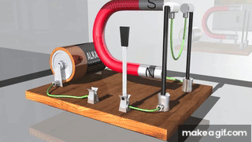

## Problem 1

# Simulating the Effects of the Lorentz Force

## Introduction

The Lorentz force governs the motion of a charged particle in electromagnetic fields and is given by

$$
\mathbf{F} = q\,\mathbf{E} + q\,\mathbf{v} \times \mathbf{B}.
$$

This force underlies the operation of cyclotrons, mass spectrometers, plasma confinement devices, and many astrophysical processes.

## Theory

1. **Uniform Magnetic Field**  
   When $\mathbf{E} = \mathbf{0}$ and $\mathbf{B} = B\,\hat{\mathbf{z}}$, a particle of charge $q$ and mass $m$ undergoes circular motion in the plane perpendicular to $\mathbf{B}$, with Larmor radius

   $$
   r_L = \frac{m\,v_\perp}{|q|\,B}, 
   $$

   and angular frequency (cyclotron frequency)

   $$
   \omega_c = \frac{|q|\,B}{m}.
   $$

2. **Parallel Electric and Magnetic Fields**  
   If both $\mathbf{E}$ and $\mathbf{B}$ point along $\hat{\mathbf{z}}$, the particle experiences circular motion plus uniform acceleration along the field, resulting in a helical trajectory.

3. **Crossed Electric and Magnetic Fields**  
   For $\mathbf{E} \perp \mathbf{B}$, in addition to gyration, the particle drifts with velocity

   $$
   \mathbf{v}_d = \frac{\mathbf{E} \times \mathbf{B}}{B^2}.
   $$

## Numerical Method

We employ a simple Euler integrator with time step $\Delta t$:

$$
\mathbf{v}_{n+1} = \mathbf{v}_n + \frac{q}{m}\bigl(\mathbf{E} + \mathbf{v}_n \times \mathbf{B}\bigr)\Delta t,
\quad
\mathbf{r}_{n+1} = \mathbf{r}_n + \mathbf{v}_n\,\Delta t.
$$

**Parameters:**

- Charge: $q = 1.0\ \mathrm{C}$  
- Mass: $m = 1.0\ \mathrm{kg}$  
- Time step: $\Delta t = 0.01\ \mathrm{s}$  
- Number of steps: $1000$  

## Python Implementation

```python
import numpy as np
import matplotlib.pyplot as plt
from matplotlib.animation import FuncAnimation, PillowWriter

def lorentz_acceleration(v, q, m, E, B):
    return (q/m) * (E + np.cross(v, B))

def simulate_rk4(q, m, E, B, v0, dt, steps):
    r = np.zeros((steps, 3))
    v = np.zeros((steps, 3))
    r[0] = np.zeros(3)
    v[0] = np.array(v0, float)
    for i in range(steps-1):
        k1_v = lorentz_acceleration(v[i], q, m, E, B)
        k1_r = v[i]
        k2_v = lorentz_acceleration(v[i] + 0.5*dt*k1_v, q, m, E, B)
        k2_r = v[i] + 0.5*dt*k1_v
        k3_v = lorentz_acceleration(v[i] + 0.5*dt*k2_v, q, m, E, B)
        k3_r = v[i] + 0.5*dt*k2_v
        k4_v = lorentz_acceleration(v[i] + dt*k3_v, q, m, E, B)
        k4_r = v[i] + dt*k3_v

        v[i+1] = v[i] + (dt/6)*(k1_v + 2*k2_v + 2*k3_v + k4_v)
        r[i+1] = r[i] + (dt/6)*(k1_r + 2*k2_r + 2*k3_r + k4_r)
    return r, v

def animate_trajectory(r, title_top, title_bottom, filename, xlim, ylim, zlim):
    fig = plt.figure(figsize=(6,6))
    ax = fig.add_subplot(projection='3d')
    # Two-line centered title
    ax.set_title(f"{title_top}\n{title_bottom}", pad=20)
    ax.set_xlabel('x (m)'); ax.set_ylabel('y (m)'); ax.set_zlabel('z (m)')
    ax.set_xlim(*xlim); ax.set_ylim(*ylim); ax.set_zlim(*zlim)
    line, = ax.plot([], [], [], lw=2)

    def update(frame):
        line.set_data(r[:frame,0], r[:frame,1])
        line.set_3d_properties(r[:frame,2])
        return line,

    ani = FuncAnimation(fig, update, frames=len(r), interval=20, blit=True)
    ani.save(filename, writer=PillowWriter(fps=30))
    plt.close(fig)

if __name__ == '__main__':
    dt = 0.01   # time step [s]
    steps = 1000

    # Scenarios with separated title lines
    scenarios = [
        {
            'title_top': 'Uniform Magnetic Field',
            'title_bottom': '(B=1.0 T): Circular Motion',
            'E': np.zeros(3), 'B': np.array([0,0,1.0]),
            'v0': [1.0,0,0], 'q':1.0, 'm':1.0,
            'xlim':(-1.2,1.2), 'ylim':(-1.2,1.2), 'zlim':(-0.2,0.2),
            'filename':'uniform_magnetic.gif'
        },
        {
            'title_top': 'Parallel Electric & Magnetic Fields',
            'title_bottom': '(E=0.5 V/m, B=1.0 T): Helical Motion',
            'E': np.array([0,0,0.5]), 'B': np.array([0,0,1.0]),
            'v0': [1.0,0,0], 'q':1.0, 'm':1.0,
            'xlim':(-1.2,1.2), 'ylim':(-1.2,1.2), 'zlim':(0,10),
            'filename':'parallel_fields.gif'
        },
        {
            'title_top': 'Crossed Electric & Magnetic Fields',
            'title_bottom': '(E⊥B, E=0.5 V/m, B=1.0 T): Drift Motion',
            'E': np.array([0.5,0,0]), 'B': np.array([0,0,1.0]),
            'v0': [1.0,0,0], 'q':1.0, 'm':1.0,
            'xlim':(-5,5), 'ylim':(-5,5), 'zlim':(-0.2,0.2),
            'filename':'crossed_fields.gif'
        }
    ]

    for sc in scenarios:
        r, v = simulate_rk4(sc['q'], sc['m'], sc['E'], sc['B'], sc['v0'], dt, steps)
        animate_trajectory(
            r,
            title_top=sc['title_top'],
            title_bottom=sc['title_bottom'],
            filename=sc['filename'],
            xlim=sc['xlim'],
            ylim=sc['ylim'],
            zlim=sc['zlim']
        )
        print(f"Saved animation: {sc['filename']} with titles '{sc['title_top']}' and '{sc['title_bottom']}'")

```

---

## Results

1. **Uniform Magnetic Field**  
   The particle executes uniform circular motion in the \(xy\)-plane with radius  
   $$
   r_L = \frac{m\,v_0}{q\,B}.
   $$

2. **Parallel Electric & Magnetic Fields**  
   A helical trajectory appears: circular gyration in the \(xy\)-plane plus linear acceleration along \(\hat{\mathbf{z}}\).

3. **Crossed Electric & Magnetic Fields**  
   Besides gyration, a steady drift occurs perpendicular to both \(\mathbf{E}\) and \(\mathbf{B}\), with  
   $$
   \mathbf{v}_d = \frac{\mathbf{E}\times\mathbf{B}}{B^2}.
   $$

## Discussion

- **Cyclotrons:** Utilize a uniform magnetic field to bend charged particles into circular orbits; a perpendicular electric field accelerates them across gaps.  
- **Magnetic Traps (Penning/Mirrors):** Combine static \(\mathbf{E}\) and \(\mathbf{B}\) to confine plasmas; drift motions play critical roles in confinement stability.  
- **Mass Spectrometers:** Exploit the dependence of \(r_L\) on \(m/q\) to separate ion species by their curvature in a known \(\mathbf{B}\).

## Extensions

1. **Non-uniform Fields:** Introduce gradients in \(\mathbf{B}(r)\) to observe magnetic mirror effects.  
2. **Relativistic Dynamics:** Modify equations to include Lorentz factor \(\gamma = (1 - v^2/c^2)^{-1/2}\).  
3. **Monte Carlo Ensemble:** Simulate many particles with randomized initial velocities to study beam dynamics or thermal plasmas.  
4. **Numerical Methods Comparison:** Compare Euler, Runge–Kutta 4, and symplectic integrators for energy conservation.

---



