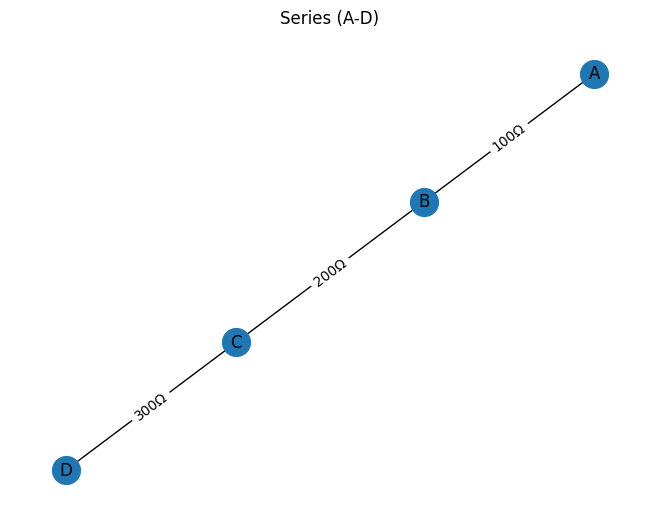
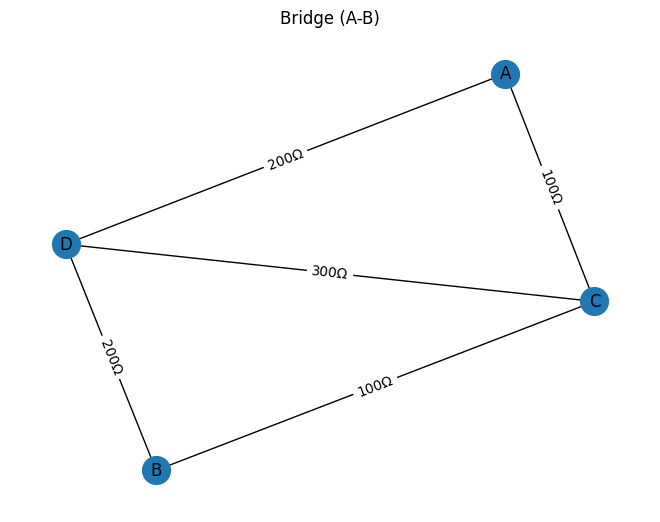
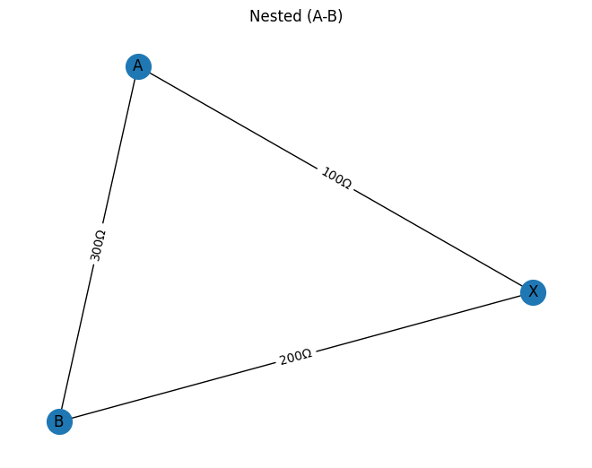

## Problem 1

# Equivalent Resistance Using Graph Theory

**Chosen Option: Advanced Task – Full Implementation**

### Motivation

Calculating equivalent resistance is fundamental for analyzing electrical networks. Traditional series–parallel rules become tedious in complex circuits. By modeling the circuit as a weighted graph—nodes as junctions, edges as resistors—you can apply algorithmic reductions and, when necessary, linear‑algebraic methods to obtain the equivalent resistance automatically.

---

### Pseudocode

```
FUNCTION EquivalentResistance(Graph G, terminals A, B):
    # Ensure G is a MultiGraph with edge attribute ‘resistance’
    MAKE a copy G₁ of G

    LOOP until no more series/parallel reductions:
        # Parallel reduction
        FOR each pair of nodes (u, v) in G₁:
            IF there are multiple edges between u and v:
                COMPUTE R_eq_parallel via
                   $$\frac{1}{R_{\rm eq}} = \sum_i \frac{1}{R_i}$$
                REMOVE all those edges
                ADD single edge (u, v) with resistance R_eq_parallel
                CONTINUE outer LOOP

        # Series reduction
        FOR each node n ≠ A, B in G₁:
            IF degree(n) == 2:
                LET neighbors be u and v
                LET R₁ = resistance(u–n), R₂ = resistance(n–v)
                SET $$R_{\rm eq}^{(\rm series)} = R_1 + R_2$$
                REMOVE node n and its two edges
                IF edge (u, v) exists:
                    # merge in parallel with R_eq_series
                    LET R_prev = resistance(u–v)
                    $$\frac{1}{R_{\rm new}} = \frac{1}{R_{\rm eq}^{(\rm series)}} + \frac{1}{R_{\rm prev}}$$
                    REMOVE old (u, v)
                ELSE:
                    R_new = R_{\rm eq}^{(\rm series)}
                ADD edge (u, v) with resistance R_new
                CONTINUE outer LOOP

        # no changes possible → exit LOOP

    IF G₁ has exactly one edge connecting A and B:
        RETURN its resistance

    # Fallback for non‑series‑parallel networks:
    BUILD Laplacian L from conductances \(g = 1/R\) for each edge  
    COMPUTE pseudoinverse \(L^+\)  
    LET i = index of A, j = index of B  
    RETURN $$L^+_{ii} + L^+_{jj} - 2\,L^+_{ij}$$
END FUNCTION
```

**Handling Nested Combinations**  
Because the loop repeats series and parallel passes until no further reduction is possible, inner series or parallel groups are collapsed first. Once an inner group is replaced by its equivalent resistor, the next iteration will detect the new adjacent reducible pattern, ensuring nested structures like a series block inside a parallel block (or vice versa) are handled automatically.

---

### Full Implementation (Python)

```python
import networkx as nx
import numpy as np
import matplotlib.pyplot as plt

def EquivalentResistance(G, A, B):
    """
    Compute the equivalent resistance between nodes A and B
    in a resistor network G (Graph or MultiGraph with edge attribute 'resistance').
    """
    # Copy the input graph into a MultiGraph
    G1 = nx.MultiGraph()
    G1.add_nodes_from(G.nodes())
    for u, v, data in G.edges(data=True):
        G1.add_edge(u, v, resistance=data['resistance'])

    # Iteratively perform parallel and series reductions
    while True:
        reduced = False

        # Parallel reduction: combine multiple edges between the same nodes
        for u, v in list(G1.edges()):
            if G1.number_of_edges(u, v) > 1:
                data_dict = G1.get_edge_data(u, v)
                resistances = [d['resistance'] for d in data_dict.values()]
                Req = 1.0 / sum(1.0 / R for R in resistances)
                for key in list(data_dict.keys()):
                    G1.remove_edge(u, v, key)
                G1.add_edge(u, v, resistance=Req)
                reduced = True
                break
        if reduced:
            continue

        # Series reduction: remove degree-2 nodes (not A or B)
        for n in list(G1.nodes()):
            if n in (A, B):
                continue
            if G1.degree(n) == 2:
                neighbors = list(G1.adj[n])
                u, v = neighbors
                data_un = G1.get_edge_data(u, n)
                R1 = list(data_un.values())[0]['resistance']
                data_nv = G1.get_edge_data(n, v)
                R2 = list(data_nv.values())[0]['resistance']
                Rseries = R1 + R2

                if G1.has_edge(u, v):
                    prev_data = G1.get_edge_data(u, v)
                    Rprev = 1.0 / sum(1.0 / d['resistance'] for d in prev_data.values())
                    for key in list(prev_data.keys()):
                        G1.remove_edge(u, v, key)
                    Rnew = 1.0 / (1.0 / Rseries + 1.0 / Rprev)
                else:
                    Rnew = Rseries

                G1.remove_node(n)
                G1.add_edge(u, v, resistance=Rnew)
                reduced = True
                break
        if not reduced:
            break

    # If a single edge remains between A and B, return its resistance
    if G1.number_of_edges(A, B) == 1:
        return float(list(G1.get_edge_data(A, B).values())[0]['resistance'])

    # Fallback: use Laplacian pseudoinverse for complex topologies
    H = nx.Graph()
    H.add_nodes_from(G1.nodes())
    for u, v, data in G1.edges(data=True):
        conductance = 1.0 / data['resistance']
        if H.has_edge(u, v):
            H[u][v]['conductance'] += conductance
        else:
            H.add_edge(u, v, conductance=conductance)

    nodes = list(H.nodes())
    index = {node: i for i, node in enumerate(nodes)}
    L = np.zeros((len(nodes), len(nodes)))
    for u, v, data in H.edges(data=True):
        i, j = index[u], index[v]
        g = data['conductance']
        L[i, i] += g
        L[j, j] += g
        L[i, j] -= g
        L[j, i] -= g

    L_plus = np.linalg.pinv(L)
    i, j = index[A], index[B]
    R_eff = L_plus[i, i] + L_plus[j, j] - 2 * L_plus[i, j]
    return float(R_eff)

def test_and_visualize():
    # Define example circuits
    examples = {}

    # Series circuit (A-D)
    G_series = nx.MultiGraph()
    G_series.add_edge('A', 'B', resistance=100)
    G_series.add_edge('B', 'C', resistance=200)
    G_series.add_edge('C', 'D', resistance=300)
    examples['Series (A-D)'] = ('A', 'D', G_series)

    # Parallel circuit (A-B)
    G_parallel = nx.MultiGraph()
    for r in (100, 200, 300):
        G_parallel.add_edge('A', 'B', resistance=r)
    examples['Parallel (A-B)'] = ('A', 'B', G_parallel)

    # Bridge circuit (A-B)
    G_bridge = nx.MultiGraph()
    edges = [
        ('A', 'C', 100), ('C', 'B', 100),
        ('A', 'D', 200), ('D', 'B', 200),
        ('C', 'D', 300)
    ]
    for u, v, r in edges:
        G_bridge.add_edge(u, v, resistance=r)
    examples['Bridge (A-B)'] = ('A', 'B', G_bridge)

    # Nested circuit (A-B)
    G_nested = nx.MultiGraph()
    G_nested.add_edge('A', 'X', resistance=100)
    G_nested.add_edge('X', 'B', resistance=200)
    G_nested.add_edge('A', 'B', resistance=300)
    examples['Nested (A-B)'] = ('A', 'B', G_nested)

    # Calculate and print results
    print("Equivalent Resistances:")
    results = {}
    for name, (A, B, graph) in examples.items():
        R = EquivalentResistance(graph, A, B)
        results[name] = R
        print(f"  {name}: {R:.2f} Ω")

    # Optional: draw circuit diagrams
    for name, (_, _, graph) in examples.items():
        plt.figure()
        pos = nx.spring_layout(graph, seed=42)
        nx.draw(graph, pos, with_labels=True, node_size=400)
        edge_labels = {(u, v): f"{d['resistance']}Ω"
                       for u, v, d in graph.edges(data=True)}
        nx.draw_networkx_edge_labels(graph, pos, edge_labels=edge_labels)
        plt.title(name)
        plt.axis('off')
    plt.show()

    # Render console output as an image file
    output_text = "Equivalent Resistances:\n" + "\n".join(
        f"  {name}: {results[name]:.2f} Ω" for name in results
    )
    fig, ax = plt.subplots(figsize=(6, 0.5 + 0.3 * len(results)))
    ax.axis('off')
    ax.text(0, 0.5, output_text, fontsize=12, family='monospace')
    fig.savefig("equivalent_resistance_output.png", bbox_inches="tight")
    print("\nSaved output image: equivalent_resistance_output.png")

if __name__ == "__main__":
    test_and_visualize()

```

---

### Demonstration on Four Examples

1. **Simple Series**  
   Three resistors \(100\), \(200\), \(300\)\,Ω in series between A and D yield  
   $$
     R_{\rm eq} = 100 + 200 + 300 = 600\ \Omega.
   $$

2. **Simple Parallel**  
   Three resistors \(100\), \(200\), \(300\)\,Ω in parallel between A and B yield  
   $$
     \frac{1}{R_{\rm eq}}
     = \frac{1}{100} + \frac{1}{200} + \frac{1}{300}
     \quad\Longrightarrow\quad
     R_{\rm eq} \approx 54.55\ \Omega.
   $$

3. **Bridge Circuit**  
   Resistors A–C:100Ω, C–B:100Ω, A–D:200Ω, D–B:200Ω, C–D:300Ω. The series–parallel pass leaves a non‑reducible bridge, so the Laplacian method gives  
   $$
     R_{\rm eq} \approx 133.33\ \Omega.
   $$

4. **Nested Combination**  
   A series block of 100Ω and 200Ω between A and B, in parallel with 300Ω, yields:  
   $$
     R_{\rm series} = 100 + 200 = 300\ \Omega,\quad
     \frac{1}{R_{\rm eq}}
     = \frac{1}{300} + \frac{1}{300}
     \quad\Longrightarrow\quad
     R_{\rm eq} = 150\ \Omega.
   $$

---

### Efficiency Analysis & Potential Improvements

- **Time Complexity**  
  - Series/parallel reduction: each pass inspects \(O(E)\) edges and \(O(N)\) nodes; worst‑case \(O(E^2)\) if many small reductions occur.  
  - Pseudoinverse fallback: dense matrix inversion of size \(n\) costs \(O(n^3)\).

- **Space Complexity**  
  - Graph storage: \(O(N + E)\).  
  - Laplacian matrix: \(O(n^2)\).

- **Potential Improvements**  
  1. **Pattern‑matching acceleration:** Use a queue of recently modified nodes/edges to avoid full scans each iteration.  
  2. **Sparse linear algebra:** For large graphs, represent the Laplacian as a sparse matrix and use iterative solvers (e.g.\ conjugate‑gradient) instead of dense pseudoinverse.  
  3. **Δ–Y (star–delta) transforms:** Extend reduction capability beyond series–parallel to handle more topologies directly.  

---
## PYTHON OUTPUT







