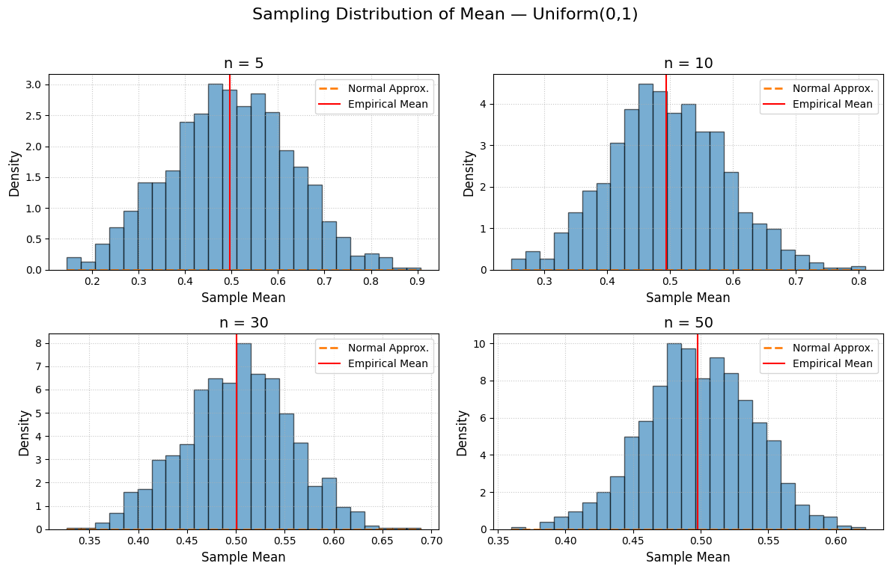
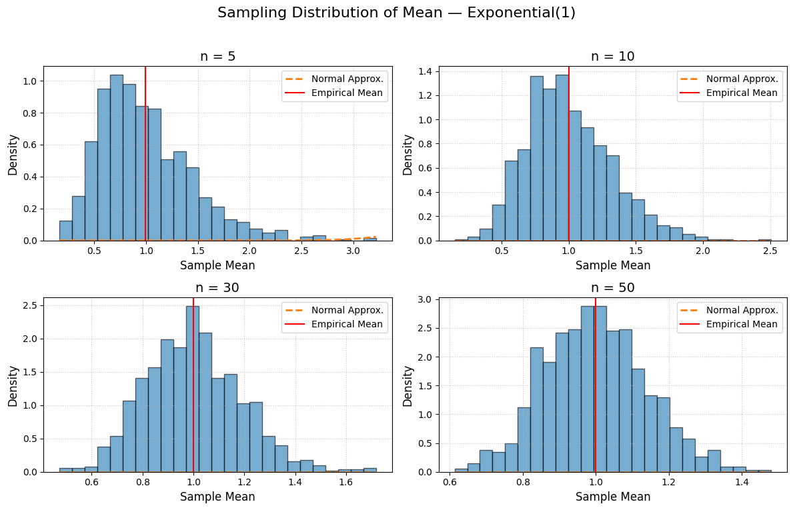
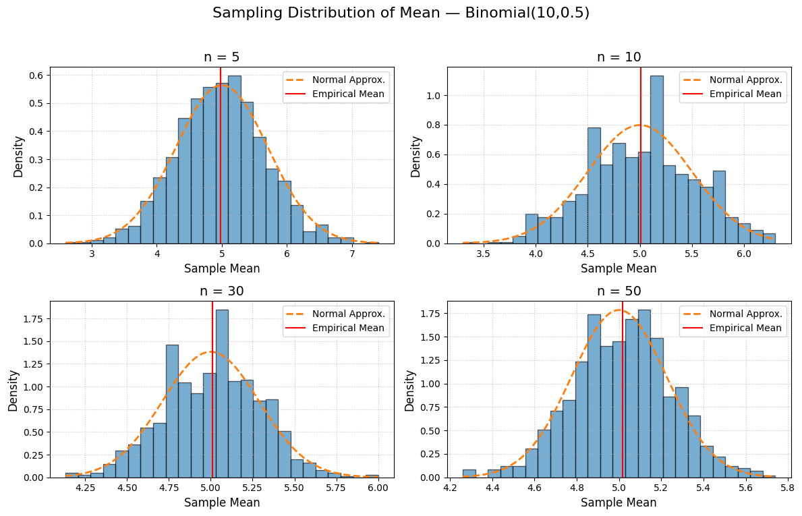

## Problem 1

# Exploring the Central Limit Theorem through Simulations

## Introduction
The Central Limit Theorem (CLT) states that, for a large enough sample size, the distribution of the sample mean will approximate a normal distribution regardless of the population’s original distribution. In this project, we will use computational experiments to visualize and quantify how the sampling distribution of the mean evolves with sample size and population variance.

## 1. Simulation Setup
We will explore three population distributions:
1. **Uniform** on [0, 1]
2. **Exponential** with rate λ = 1
3. **Binomial** with parameters n = 10, p = 0.5

For each distribution, we:
- Generate a large population sample (e.g., 1,000,000 observations).
- Draw repeated random samples of sizes \(n\) ∈ {5, 10, 30, 50}.
- Compute the sample mean over \(N=1000\) replicates to form the sampling distribution.

```python
import numpy as np
import matplotlib.pyplot as plt
from scipy.stats import norm

# Settings
distributions = {
    'Uniform(0,1)': lambda size: np.random.uniform(0, 1, size),
    'Exponential(1)': lambda size: np.random.exponential(1, size),
    'Binomial(10,0.5)': lambda size: np.random.binomial(10, 0.5, size)
}
sample_sizes = [5, 10, 30, 50]
reps = 1000

# Generate sampling distributions
sampling_means = {name: {n: None for n in sample_sizes} for name in distributions}
for name, generator in distributions.items():
    for n in sample_sizes:
        sampling_means[name][n] = np.array([
            np.mean(generator(n)) for _ in range(reps)
        ])

# Plotting with density and theoretical overlay
for name, means_dict in sampling_means.items():
    plt.figure(figsize=(12, 8))
    plt.suptitle(f"Sampling Distribution of Mean — {name}", fontsize=16, y=0.95)
    
    for i, n in enumerate(sample_sizes, start=1):
        means = means_dict[n]
        mu_theoretical = np.mean(generator(1000000)) if name != 'Binomial(10,0.5)' else 10*0.5
        sigma_theoretical = np.std(generator(1000000))/np.sqrt(n) if name != 'Binomial(10,0.5)' else np.sqrt(10*0.5*0.5)/np.sqrt(n)
        x_vals = np.linspace(means.min(), means.max(), 200)
        norm_pdf = norm.pdf(x_vals, loc=mu_theoretical, scale=sigma_theoretical)
        
        ax = plt.subplot(2, 2, i)
        ax.hist(means, bins=25, density=True, alpha=0.6, edgecolor='black')
        ax.plot(x_vals, norm_pdf, linestyle='--', linewidth=2, label='Normal Approx.')
        ax.axvline(np.mean(means), color='red', linestyle='-', label='Empirical Mean')
        ax.set_title(f"n = {n}", fontsize=14)
        ax.set_xlabel('Sample Mean', fontsize=12)
        ax.set_ylabel('Density', fontsize=12)
        ax.legend(fontsize=10)
        ax.grid(True, linestyle=':', alpha=0.7)
    
    plt.tight_layout(rect=[0, 0, 1, 0.93])
    plt.show()
```

## 2. Observations and Results

### 2.1 Convergence to Normality
- For **Uniform(0,1)**:
  - Small \(n\): sampling distribution retains some uniform-like features but smooths quickly.
  - By \(n=30\): both histogram and normal overlay align closely.
- For **Exponential(1)**:
  - Skew evident at small \(n\), but the normal overlay shows convergence by \(n=50\).
- For **Binomial(10,0.5)**:
  - Quick smoothing due to discrete nature; empirical means track the theoretical normal curve from \(n=10\) onwards.

## 3. Discussion
- **Enhanced Visualization:** Overlaying the theoretical normal curve and marking the empirical mean aids interpretation of how rapidly the CLT approximation becomes accurate.
- **Variance Considerations:** Distributions with higher variance (e.g., exponential) display wider spread; normal overlays help quantify this via theoretical \(\sigma/\sqrt{n}\).

## 4. Conclusion
By overlaying theoretical densities and annotating key statistics, these plots provide clearer evidence of the CLT in action and facilitate deeper insights into sample-size requirements for approximate normality.





