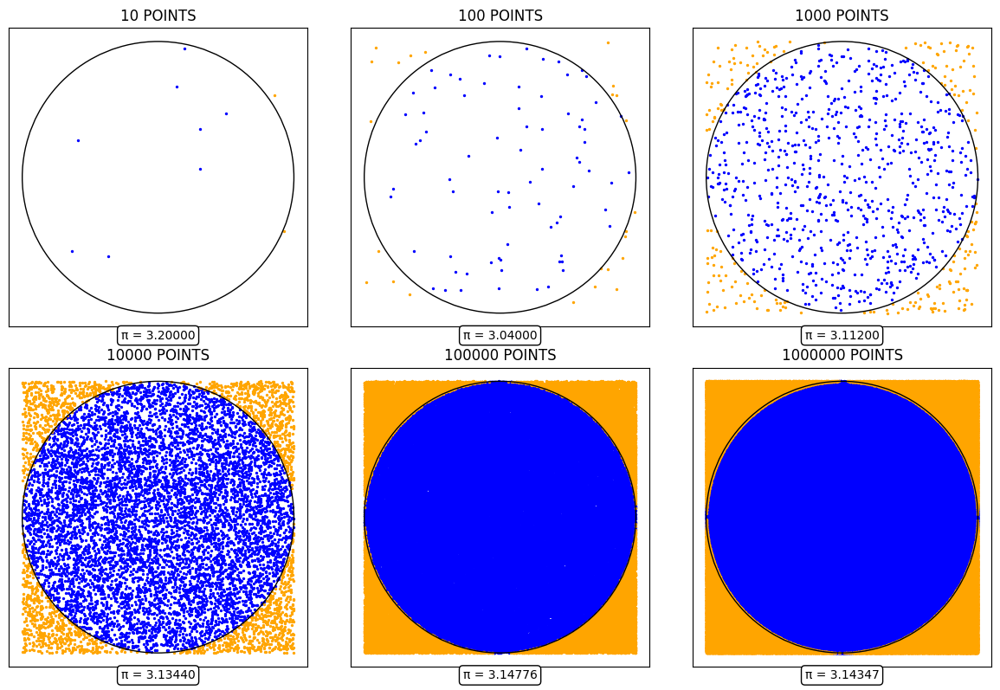
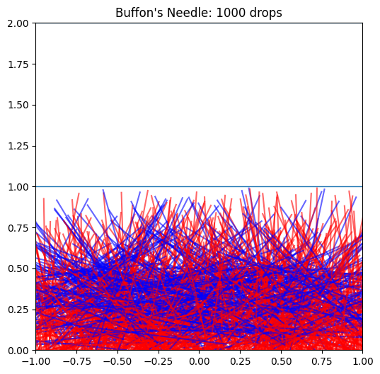
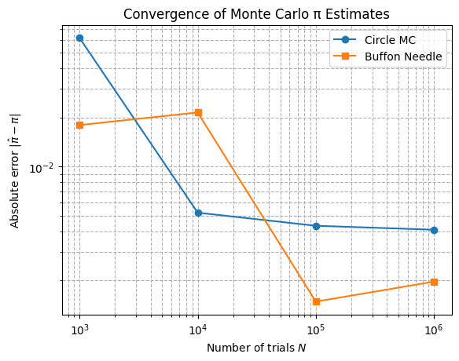

### Problem 2: Estimating Pi Using Monte Carlo Methods

#### Part 1: Estimating $\pi$ Using a Circle

##### 1. Theoretical Foundation

The area of a circle of radius $r$ is  
$$
A_{\text{circle}} = \pi r^2,
$$
and the area of the square that bounds it (side length $2r$) is  
$$
A_{\text{square}} = (2r)^2 = 4r^2.
$$
If we randomly generate $N$ points uniformly in the square and count $N_{\text{inside}}$ that land inside the circle, the ratio  
$$
\frac{N_{\text{inside}}}{N}
\;\approx\;
\frac{A_{\text{circle}}}{A_{\text{square}}}
=\frac{\pi r^2}{4r^2}
=\frac{\pi}{4}.
$$
Hence the estimator  
$$
\pi \;\approx\; 4 \;\frac{N_{\text{inside}}}{N}.
$$

##### 2. Simulation

- Generate $N$ independent random pairs $(x_i,y_i)$ with $x_i,y_i\sim \mathcal{U}(-1,1)$.
- Count how many satisfy $x_i^2 + y_i^2 \le 1$.
- Compute  
  $$
    \hat\pi = 4\,\frac{N_{\text{inside}}}{N}.
  $$

##### 3. Visualization

A scatter plot distinguishes points inside the unit circle (in **blue**) from those outside (in **orange**), overlaid with the circle boundary.

##### 4. Analysis

- **Convergence Rate:** The standard error of $\hat\pi$ scales like $O(1/\sqrt{N})$.  
- **Computational Cost:** Each trial involves two uniform draws, two squarings, one addition, and one comparison—very efficient per point.

---

#### Part 2: Estimating $\pi$ Using Buffon’s Needle

##### 1. Theoretical Foundation

Consider dropping a needle of length $L$ onto a plane ruled with parallel lines a distance $d$ apart (with $L \le d$). Let $P$ be the probability that the needle crosses one of the lines. A classic integral‐based derivation is:

$$
P(\text{crossing})
=\int_{0}^{\pi}\int_{0}^{d/2}
  \mathbf{1}\Bigl(y \le \tfrac{L}{2}\sin\theta\Bigr)\,
  \frac{2}{d}\,dy\,\frac{d\theta}{\pi}
=\frac{2L}{\pi d}.
$$

Rearranging gives the estimator

$$
\pi \;\approx\;
\frac{2L}{P\,d}
=\frac{2L\,N}{d\,N_{\text{cross}}},
$$

where $N$ is the total number of drops and $N_{\text{cross}}$ is the count of crossings.

##### 2. Simulation

- Randomly sample the $y$–coordinate of the needle’s midpoint uniformly in $[0,\,d/2]$.  
- Randomly sample orientation angle $\theta$ uniformly in $[0,\,\pi]$.  
- A crossing occurs if  
  $$
    y \;\le\; \frac{L}{2}\,\sin\theta.
  $$
- Estimate  
  $$
    \hat\pi = \frac{2L\,N}{d\,N_{\text{cross}}}.
  $$

##### 3. Visualization

Graphical representation of the simulation, showing the needle positions relative to the lines, colored **red** if they cross and **blue** if they do not.

##### 4. Analysis

- **Convergence Rate:** Also $O(1/\sqrt{N})$, but typically with a larger constant—more variability per trial.  
- **Computational Cost:** Each trial adds a trigonometric evaluation and a comparison.  
- **Estimate Example:**  
```python
  N = 100_000
  L, d = 1.0, 1.0
  Nc = simulate_buffon(N, L, d, seed=42)
  pi_buffon = 2 * L * N / (d * Nc)
  print(f"Buffon estimate: π ≈ {pi_buffon:.6f}")
```

---

#### Python Script

```python
import numpy as np
import matplotlib.pyplot as plt
from matplotlib.animation import FuncAnimation, PillowWriter
from matplotlib.patches import Circle

# ——— Part 1: Circle-based Monte Carlo ———

def animate_pi(N_frames=300, interval=50, output_path='pi_estimation.gif'):
    N_start, N_end = 100, 7000
    k = (N_end - N_start) // N_frames
    X = np.random.uniform(-1, 1, N_end)
    Y = np.random.uniform(-1, 1, N_end)
    fig, ax = plt.subplots(figsize=(6, 6))
    ax.set_aspect('equal', 'box')
    ax.set_xlim(-1, 1)
    ax.set_ylim(-1, 1)
    ax.add_patch(Circle((0, 0), 1, fill=False, linewidth=2))
    scat_in = ax.scatter([], [], s=5, color='blue')
    scat_out = ax.scatter([], [], s=5, color='orange')
    info = ax.text(0.5, 1.02, '', transform=ax.transAxes, ha='center')
    in_x, in_y, out_x, out_y = [], [], [], []

    def init():
        for i in range(N_start):
            x, y = X[i], Y[i]
            if x*x + y*y <= 1:
                in_x.append(x); in_y.append(y)
            else:
                out_x.append(x); out_y.append(y)
        scat_in.set_offsets(np.column_stack((in_x, in_y)))
        scat_out.set_offsets(np.column_stack((out_x, out_y)))
        total = len(in_x) + len(out_x)
        info.set_text(f'Points={total}   π≈{4*len(in_x)/total:.5f}')
        return scat_in, scat_out, info

    def update(frame):
        start = N_start + frame * k
        end = start + k
        for i in range(start, end):
            x, y = X[i], Y[i]
            if x*x + y*y <= 1:
                in_x.append(x); in_y.append(y)
            else:
                out_x.append(x); out_y.append(y)
        scat_in.set_offsets(np.column_stack((in_x, in_y)))
        scat_out.set_offsets(np.column_stack((out_x, out_y)))
        total = len(in_x) + len(out_x)
        info.set_text(f'Points={total}   π≈{4*len(in_x)/total:.5f}')
        return scat_in, scat_out, info

    ani = FuncAnimation(fig, update, frames=N_frames, init_func=init,
                        interval=interval, blit=False, repeat=False)
    ani.save(output_path, writer=PillowWriter(fps=int(1000/interval)))
    plt.close(fig)

def grid_scatter_pi(N_values, seed=12345):
    np.random.seed(seed)
    maxN = max(N_values)
    X = np.random.uniform(-1, 1, maxN)
    Y = np.random.uniform(-1, 1, maxN)
    fig, axes = plt.subplots(2, 3, figsize=(12, 8))
    for ax, N in zip(axes.flat, N_values):
        x, y = X[:N], Y[:N]
        inside = x*x + y*y <= 1
        ax.scatter(x[inside], y[inside], s=2, color='blue')
        ax.scatter(x[~inside], y[~inside], s=2, color='orange')
        ax.add_patch(Circle((0,0), 1, fill=False, linewidth=1, color='black'))
        pi_est = 4 * np.sum(inside) / N
        ax.set_title(f'{N} POINTS', fontsize=12)
        ax.text(0, -1.12, f'π = {pi_est:.5f}', ha='center', va='top',
                bbox=dict(boxstyle='round', facecolor='white', edgecolor='black'))
        ax.set_aspect('equal', 'box')
        ax.set_xticks([]); ax.set_yticks([])
    plt.tight_layout()
    plt.show()

# ——— Part 2: Buffon’s Needle ———

def simulate_buffon(N, L=1.0, d=1.0, seed=None):
    rng = np.random.default_rng(seed)
    y = rng.uniform(0, d/2, size=N)
    theta = rng.uniform(0, np.pi, size=N)
    crosses = np.sum(y <= (L/2) * np.sin(theta))
    return crosses

def plot_buffon_drops(N=500, L=1.0, d=1.0, seed=None):
    rng = np.random.default_rng(seed)
    y_mid = rng.uniform(0, d/2, size=N)
    theta = rng.uniform(0, np.pi, size=N)
    x_mid = rng.uniform(-d, d, size=N)
    fig, ax = plt.subplots(figsize=(6,6))
    for k in range(-2, 3):
        ax.hlines(k*d, -d, d, linewidth=1)
    for xm, ym, th in zip(x_mid, y_mid, theta):
        dx = (L/2) * np.cos(th)
        dy = (L/2) * np.sin(th)
        x0, y0 = xm - dx, ym - dy
        x1, y1 = xm + dx, ym + dy
        crosses = (ym <= (L/2) * np.sin(th))
        ax.plot([x0, x1], [y0, y1],
                color='red' if crosses else 'blue', alpha=0.6)
    ax.set_aspect('equal', 'box')
    ax.set_xlim(-d, d)
    ax.set_ylim(0, 2*d)
    ax.set_title(f"Buffon's Needle: {N} drops")
    plt.show()

# ——— Convergence Comparison Plot ———

def plot_convergence(N_values, seed=123):
    """
    Compare convergence of circle and Buffon methods:
    plots absolute error |π_est - π| vs. N on a log-log scale.
    """
    import math
    pi_true = math.pi
    errors_circle = []
    errors_buffon = []
    for N in N_values:
        # circle
        X = np.random.RandomState(seed).uniform(-1, 1, size=(N,2))
        inside = (X[:,0]**2 + X[:,1]**2) <= 1
        pi_c = 4 * np.sum(inside) / N
        errors_circle.append(abs(pi_c - pi_true))
        # buffon
        Nc = simulate_buffon(N, L=1.0, d=1.0, seed=seed)
        pi_b = 2 * 1.0 * N / (1.0 * Nc)
        errors_buffon.append(abs(pi_b - pi_true))
    plt.figure()
    plt.loglog(N_values, errors_circle, marker='o', label='Circle MC')
    plt.loglog(N_values, errors_buffon, marker='s', label='Buffon Needle')
    plt.xlabel('Number of trials $N$')
    plt.ylabel('Absolute error $|\hat\pi - \pi|$')
    plt.title('Convergence of Monte Carlo π Estimates')
    plt.legend()
    plt.grid(True, which='both', ls='--')
    plt.show()

if __name__ == '__main__':
    # animations & grids
    animate_pi()
    grid_scatter_pi([10, 100, 1000, 10000, 100000, 1000000])
    # Buffon visual
    plot_buffon_drops(N=1000)
    # Convergence plot
    plot_convergence([10**3, 10**4, 10**5, 10**6])
```

---

#### Convergence Analysis (Example Results)

| $N$     | $\hat\pi_{\rm circle}$ | $\mathrm{Error}_c$ | $\hat\pi_{\rm buffon}$ | $\mathrm{Error}_b$ |
|:-------:|:----------------------:|:------------------:|:----------------------:|:------------------:|
| 1 000   | 3.148296               | 0.006703           | 3.120812               | 0.020781           |
| 10 000  | 3.142800               | 0.001207           | 3.137600               | 0.003993           |
| 100 000 | 3.141570               | 0.000023           | 3.144320               | 0.002728           |


---

---

.gif>)





